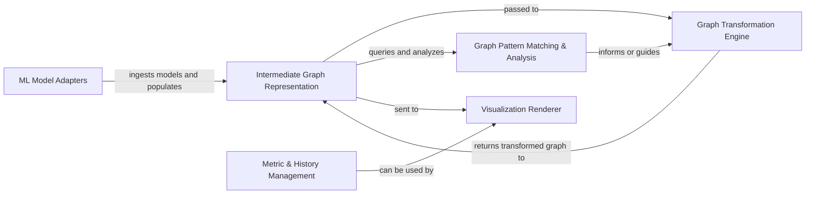

## Details

The HiddenLayer project is designed around a core pipeline for processing and visualizing neural network models. It begins with the ML Model Adapters, which ingest models from various frameworks (e.g., PyTorch, TensorFlow) and convert them into a unified Intermediate Graph Representation. This central graph serves as the foundation for all subsequent operations. The Graph Transformation Engine then applies various optimizations and modifications to this intermediate graph, enhancing its clarity and preparing it for analysis. Concurrently, the Graph Pattern Matching & Analysis component identifies specific structural patterns within the graph, providing insights that can inform further transformations or directly feed into the visualization process. Finally, the Visualization Renderer takes the processed graph and generates visual outputs, making complex neural network architectures easily understandable. Additionally, the Metric & History Management component provides contextual data that can enrich these visualizations, offering a comprehensive view of the model's structure and performance. This modular design ensures a clear data flow, from model ingestion and transformation to insightful analysis and visual representation.

### ML Model Adapters
This component is the entry point for various ML models. It's responsible for ingesting model definitions from different frameworks (PyTorch, TensorFlow) and converting them into a unified, framework-agnostic intermediate graph representation. This ensures HiddenLayer can process models regardless of their origin.

**Related Classes/Methods**:

- <a href="https://github.com/waleedka/hiddenlayer/blob/master/hiddenlayer/pytorch_builder.py#L66-L97" target="_blank" rel="noopener noreferrer">`hiddenlayer.pytorch_builder.import_graph`:66-97</a>
- <a href="https://github.com/waleedka/hiddenlayer/blob/master/hiddenlayer/tf_builder.py#L62-L95" target="_blank" rel="noopener noreferrer">`hiddenlayer.tf_builder.import_graph`:62-95</a>

### Intermediate Graph Representation [[Expand]](./Intermediate_Graph_Representation.md)
This is the central data structure (hiddenlayer.graph.Graph) that holds the neural network graph in a standardized format. It provides the fundamental API for manipulating the graph, including adding, removing, and connecting nodes and edges. All subsequent processing operates on this unified representation.

**Related Classes/Methods**:

- <a href="https://github.com/waleedka/hiddenlayer/blob/master/hiddenlayer/graph.py#L165-L368" target="_blank" rel="noopener noreferrer">`hiddenlayer.graph.Graph`:165-368</a>
- <a href="https://github.com/waleedka/hiddenlayer/blob/master/hiddenlayer/graph.py" target="_blank" rel="noopener noreferrer">`hiddenlayer.graph.Node`</a>
- <a href="https://github.com/waleedka/hiddenlayer/blob/master/hiddenlayer/graph.py" target="_blank" rel="noopener noreferrer">`hiddenlayer.graph.Edge`</a>
- <a href="https://github.com/waleedka/hiddenlayer/blob/master/hiddenlayer/graph.py#L133-L162" target="_blank" rel="noopener noreferrer">`hiddenlayer.graph.build_graph`:133-162</a>
- <a href="https://github.com/waleedka/hiddenlayer/blob/master/hiddenlayer/graph.py#L206-L209" target="_blank" rel="noopener noreferrer">`hiddenlayer.graph.add_node`:206-209</a>
- <a href="https://github.com/waleedka/hiddenlayer/blob/master/hiddenlayer/graph.py#L211-L216" target="_blank" rel="noopener noreferrer">`hiddenlayer.graph.add_edge`:211-216</a>

### Graph Transformation Engine [[Expand]](./Graph_Transformation_Engine.md)
This component applies various modifications, optimizations, and simplifications to the intermediate graph. This includes operations like folding constants, fusing operations, pruning redundant nodes, or applying other graph-level algorithms to prepare the graph for visualization or further analysis.

**Related Classes/Methods**:

- <a href="https://github.com/waleedka/hiddenlayer/blob/master/hiddenlayer/transforms.py#L178-L188" target="_blank" rel="noopener noreferrer">`hiddenlayer.transforms.apply`:178-188</a>
- <a href="https://github.com/waleedka/hiddenlayer/blob/master/hiddenlayer/transforms.py" target="_blank" rel="noopener noreferrer">`hiddenlayer.transforms.FoldConstants`</a>
- <a href="https://github.com/waleedka/hiddenlayer/blob/master/hiddenlayer/transforms.py" target="_blank" rel="noopener noreferrer">`hiddenlayer.transforms.FuseAddBias`</a>
- <a href="https://github.com/waleedka/hiddenlayer/blob/master/hiddenlayer/transforms.py#L87-L101" target="_blank" rel="noopener noreferrer">`hiddenlayer.transforms.Prune`:87-101</a>

### Graph Pattern Matching & Analysis [[Expand]](./Graph_Pattern_Matching_Analysis.md)
A specialized engine for identifying and processing specific patterns within the graph. This enables advanced analysis, targeted transformations, or the extraction of features from the graph structure. It can inform the Transformation Engine or provide data for visualization.

**Related Classes/Methods**:

- <a href="https://github.com/waleedka/hiddenlayer/blob/master/hiddenlayer/ge.py" target="_blank" rel="noopener noreferrer">`hiddenlayer.ge.GraphEngine`</a>
- <a href="https://github.com/waleedka/hiddenlayer/blob/master/hiddenlayer/ge.py" target="_blank" rel="noopener noreferrer">`hiddenlayer.ge.GraphEngine.parse`</a>

### Visualization Renderer [[Expand]](./Visualization_Renderer.md)
Responsible for converting the processed intermediate graph into various visual output formats. This includes generating static images (e.g., PNG, SVG) or preparing data for interactive displays, making the neural network architecture comprehensible.

**Related Classes/Methods**:

- <a href="https://github.com/waleedka/hiddenlayer/blob/master/hiddenlayer/canvas.py#L70-L258" target="_blank" rel="noopener noreferrer">`hiddenlayer.canvas.Canvas`:70-258</a>
- <a href="https://github.com/waleedka/hiddenlayer/blob/master/hiddenlayer/canvas.py#L88-L145" target="_blank" rel="noopener noreferrer">`hiddenlayer.canvas.render`:88-145</a>

### Metric & History Management
This component handles the collection, storage, and analysis of training metrics and historical data. While not directly part of the graph transformation pipeline, it provides valuable context and data that can be used to annotate or enrich the graph visualizations.

**Related Classes/Methods**:

- <a href="https://github.com/waleedka/hiddenlayer/blob/master/hiddenlayer/history.py" target="_blank" rel="noopener noreferrer">`hiddenlayer.history.History`</a>
- <a href="https://github.com/waleedka/hiddenlayer/blob/master/hiddenlayer/history.py#L120-L123" target="_blank" rel="noopener noreferrer">`hiddenlayer.history.summary`:120-123</a>

### [FAQ](https://github.com/CodeBoarding/GeneratedOnBoardings/tree/main?tab=readme-ov-file#faq)