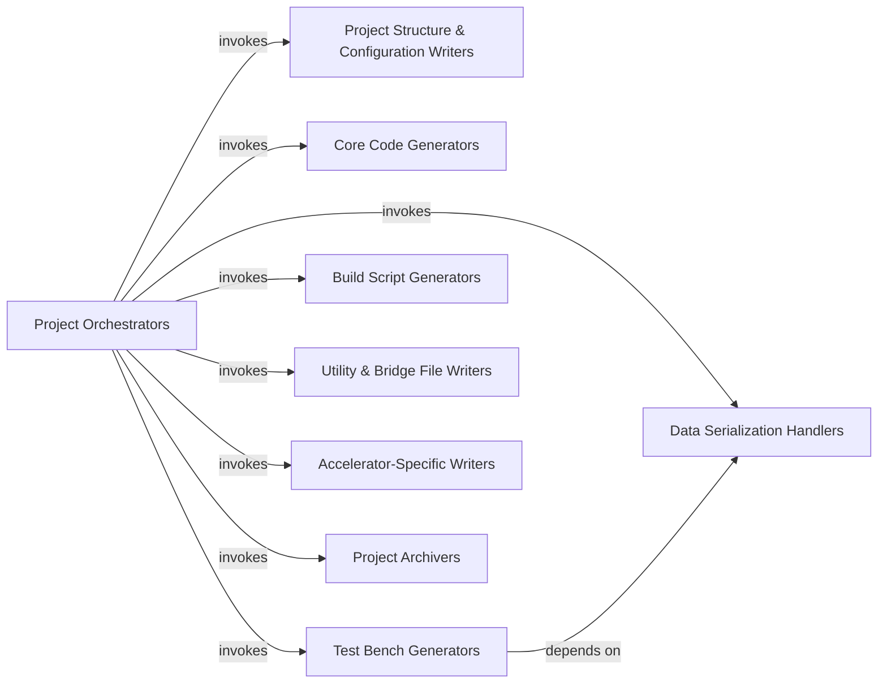

## Details

The Code Generation & Project Writer subsystem is a critical part of the hls4ml project, responsible for translating the Intermediate Representation (IR) into hardware-description-language-specific files for various High-Level Synthesis (HLS) backends. This subsystem encompasses all functionalities related to generating the complete HLS project, including source code, configuration files, test benches, and build scripts.

### Project Orchestrators
Orchestrate the entire code generation process for a specific HLS backend. These functions act as the primary entry points for generating a complete HLS project, invoking functions from other components sequentially.

**Related Classes/Methods**:

- <a href="https://github.com/fastmachinelearning/hls4ml/blob/main/hls4ml/writer/vivado_writer.py#L1-L2" target="_blank" rel="noopener noreferrer">`hls4ml.writer.vivado_writer:write_hls`:1-2</a>
- <a href="https://github.com/fastmachinelearning/hls4ml/blob/main/hls4ml/writer/catapult_writer.py#L1-L2" target="_blank" rel="noopener noreferrer">`hls4ml.writer.catapult_writer:write_hls`:1-2</a>
- <a href="https://github.com/fastmachinelearning/hls4ml/blob/main/hls4ml/writer/oneapi_writer.py#L1-L2" target="_blank" rel="noopener noreferrer">`hls4ml.writer.oneapi_writer:write_hls`:1-2</a>
- <a href="https://github.com/fastmachinelearning/hls4ml/blob/main/hls4ml/writer/quartus_writer.py#L1-L2" target="_blank" rel="noopener noreferrer">`hls4ml.writer.quartus_writer:write_hls`:1-2</a>
- <a href="https://github.com/fastmachinelearning/hls4ml/blob/main/hls4ml/writer/symbolic_writer.py#L1-L2" target="_blank" rel="noopener noreferrer">`hls4ml.writer.symbolic_writer:write_hls`:1-2</a>
- <a href="https://github.com/fastmachinelearning/hls4ml/blob/main/hls4ml/writer/vitis_writer.py#L1-L2" target="_blank" rel="noopener noreferrer">`hls4ml.writer.vitis_writer:write_hls`:1-2</a>
- <a href="https://github.com/fastmachinelearning/hls4ml/blob/main/hls4ml/writer/vivado_accelerator_writer.py#L1-L2" target="_blank" rel="noopener noreferrer">`hls4ml.writer.vivado_accelerator_writer:write_hls`:1-2</a>

### Project Structure & Configuration Writers
Establish the required directory structure for the HLS project and write configuration files (e.g., YAML, parameters, defines) that are crucial for guiding the HLS synthesis process for different backends.

**Related Classes/Methods**:

- <a href="https://github.com/fastmachinelearning/hls4ml/blob/main/hls4ml/writer/vivado_writer.py#L1-L2" target="_blank" rel="noopener noreferrer">`hls4ml.writer.vivado_writer:write_project_dir`:1-2</a>
- <a href="https://github.com/fastmachinelearning/hls4ml/blob/main/hls4ml/writer/vivado_writer.py#L1-L2" target="_blank" rel="noopener noreferrer">`hls4ml.writer.vivado_writer:write_yml`:1-2</a>
- <a href="https://github.com/fastmachinelearning/hls4ml/blob/main/hls4ml/writer/vivado_writer.py#L1-L2" target="_blank" rel="noopener noreferrer">`hls4ml.writer.vivado_writer:write_defines`:1-2</a>
- <a href="https://github.com/fastmachinelearning/hls4ml/blob/main/hls4ml/writer/vivado_writer.py#L1-L2" target="_blank" rel="noopener noreferrer">`hls4ml.writer.vivado_writer:write_parameters`:1-2</a>
- <a href="https://github.com/fastmachinelearning/hls4ml/blob/main/hls4ml/writer/catapult_writer.py#L1-L2" target="_blank" rel="noopener noreferrer">`hls4ml.writer.catapult_writer:write_project_dir`:1-2</a>
- <a href="https://github.com/fastmachinelearning/hls4ml/blob/main/hls4ml/writer/catapult_writer.py#L1-L2" target="_blank" rel="noopener noreferrer">`hls4ml.writer.catapult_writer:write_yml`:1-2</a>
- <a href="https://github.com/fastmachinelearning/hls4ml/blob/main/hls4ml/writer/catapult_writer.py#L1-L2" target="_blank" rel="noopener noreferrer">`hls4ml.writer.catapult_writer:write_defines`:1-2</a>
- <a href="https://github.com/fastmachinelearning/hls4ml/blob/main/hls4ml/writer/catapult_writer.py#L1-L2" target="_blank" rel="noopener noreferrer">`hls4ml.writer.catapult_writer:write_parameters`:1-2</a>
- <a href="https://github.com/fastmachinelearning/hls4ml/blob/main/hls4ml/writer/oneapi_writer.py#L1-L2" target="_blank" rel="noopener noreferrer">`hls4ml.writer.oneapi_writer:write_project_dir`:1-2</a>
- <a href="https://github.com/fastmachinelearning/hls4ml/blob/main/hls4ml/writer/oneapi_writer.py#L1-L2" target="_blank" rel="noopener noreferrer">`hls4ml.writer.oneapi_writer:write_yml`:1-2</a>
- <a href="https://github.com/fastmachinelearning/hls4ml/blob/main/hls4ml/writer/oneapi_writer.py#L1-L2" target="_blank" rel="noopener noreferrer">`hls4ml.writer.oneapi_writer:write_defines`:1-2</a>
- <a href="https://github.com/fastmachinelearning/hls4ml/blob/main/hls4ml/writer/oneapi_writer.py#L1-L2" target="_blank" rel="noopener noreferrer">`hls4ml.writer.oneapi_writer:write_parameters`:1-2</a>
- <a href="https://github.com/fastmachinelearning/hls4ml/blob/main/hls4ml/writer/quartus_writer.py#L1-L2" target="_blank" rel="noopener noreferrer">`hls4ml.writer.quartus_writer:write_project_dir`:1-2</a>
- <a href="https://github.com/fastmachinelearning/hls4ml/blob/main/hls4ml/writer/quartus_writer.py#L1-L2" target="_blank" rel="noopener noreferrer">`hls4ml.writer.quartus_writer:write_yml`:1-2</a>
- <a href="https://github.com/fastmachinelearning/hls4ml/blob/main/hls4ml/writer/quartus_writer.py#L1-L2" target="_blank" rel="noopener noreferrer">`hls4ml.writer.quartus_writer:write_defines`:1-2</a>
- <a href="https://github.com/fastmachinelearning/hls4ml/blob/main/hls4ml/writer/quartus_writer.py#L1-L2" target="_blank" rel="noopener noreferrer">`hls4ml.writer.quartus_writer:write_parameters`:1-2</a>

### Core Code Generators
Generate the primary C++/SystemC source code and header files that implement the neural network model's logic, translating the Intermediate Representation (IR) into hardware-description-language-specific code.

**Related Classes/Methods**:

- <a href="https://github.com/fastmachinelearning/hls4ml/blob/main/hls4ml/writer/vivado_writer.py#L1-L2" target="_blank" rel="noopener noreferrer">`hls4ml.writer.vivado_writer:write_project_cpp`:1-2</a>
- <a href="https://github.com/fastmachinelearning/hls4ml/blob/main/hls4ml/writer/vivado_writer.py#L1-L2" target="_blank" rel="noopener noreferrer">`hls4ml.writer.vivado_writer:write_project_header`:1-2</a>
- <a href="https://github.com/fastmachinelearning/hls4ml/blob/main/hls4ml/writer/vivado_writer.py#L1-L2" target="_blank" rel="noopener noreferrer">`hls4ml.writer.vivado_writer:write_generated_code`:1-2</a>
- <a href="https://github.com/fastmachinelearning/hls4ml/blob/main/hls4ml/writer/catapult_writer.py#L1-L2" target="_blank" rel="noopener noreferrer">`hls4ml.writer.catapult_writer:write_project_cpp`:1-2</a>
- <a href="https://github.com/fastmachinelearning/hls4ml/blob/main/hls4ml/writer/catapult_writer.py#L1-L2" target="_blank" rel="noopener noreferrer">`hls4ml.writer.catapult_writer:write_project_header`:1-2</a>
- <a href="https://github.com/fastmachinelearning/hls4ml/blob/main/hls4ml/writer/catapult_writer.py#L1-L2" target="_blank" rel="noopener noreferrer">`hls4ml.writer.catapult_writer:write_generated_code`:1-2</a>
- <a href="https://github.com/fastmachinelearning/hls4ml/blob/main/hls4ml/writer/oneapi_writer.py#L1-L2" target="_blank" rel="noopener noreferrer">`hls4ml.writer.oneapi_writer:write_project_cpp`:1-2</a>
- <a href="https://github.com/fastmachinelearning/hls4ml/blob/main/hls4ml/writer/oneapi_writer.py#L1-L2" target="_blank" rel="noopener noreferrer">`hls4ml.writer.oneapi_writer:write_project_header`:1-2</a>
- <a href="https://github.com/fastmachinelearning/hls4ml/blob/main/hls4ml/writer/oneapi_writer.py#L1-L2" target="_blank" rel="noopener noreferrer">`hls4ml.writer.oneapi_writer:write_generated_code`:1-2</a>
- <a href="https://github.com/fastmachinelearning/hls4ml/blob/main/hls4ml/writer/quartus_writer.py#L1-L2" target="_blank" rel="noopener noreferrer">`hls4ml.writer.quartus_writer:write_project_cpp`:1-2</a>
- <a href="https://github.com/fastmachinelearning/hls4ml/blob/main/hls4ml/writer/quartus_writer.py#L1-L2" target="_blank" rel="noopener noreferrer">`hls4ml.writer.quartus_writer:write_project_header`:1-2</a>
- <a href="https://github.com/fastmachinelearning/hls4ml/blob/main/hls4ml/writer/quartus_writer.py#L1-L2" target="_blank" rel="noopener noreferrer">`hls4ml.writer.quartus_writer:write_generated_code`:1-2</a>

### Data Serialization Handlers
Format and write model weights, biases, and activation lookup tables into C++ arrays or external data files, ensuring they are correctly structured for hardware implementation. This component often relies on lower-level utility functions for data formatting.

**Related Classes/Methods**:

- <a href="https://github.com/fastmachinelearning/hls4ml/blob/main/hls4ml/writer/vivado_writer.py#L1-L2" target="_blank" rel="noopener noreferrer">`hls4ml.writer.vivado_writer:write_weights`:1-2</a>
- <a href="https://github.com/fastmachinelearning/hls4ml/blob/main/hls4ml/writer/vivado_writer.py#L1-L2" target="_blank" rel="noopener noreferrer">`hls4ml.writer.vivado_writer:print_array_to_cpp`:1-2</a>
- <a href="https://github.com/fastmachinelearning/hls4ml/blob/main/hls4ml/writer/vivado_writer.py#L1-L2" target="_blank" rel="noopener noreferrer">`hls4ml.writer.vivado_writer:write_activation_tables`:1-2</a>
- <a href="https://github.com/fastmachinelearning/hls4ml/blob/main/hls4ml/writer/vivado_writer.py#L1-L2" target="_blank" rel="noopener noreferrer">`hls4ml.writer.vivado_writer:__make_dat_file`:1-2</a>
- <a href="https://github.com/fastmachinelearning/hls4ml/blob/main/hls4ml/writer/catapult_writer.py#L1-L2" target="_blank" rel="noopener noreferrer">`hls4ml.writer.catapult_writer:write_weights`:1-2</a>
- <a href="https://github.com/fastmachinelearning/hls4ml/blob/main/hls4ml/writer/catapult_writer.py#L1-L2" target="_blank" rel="noopener noreferrer">`hls4ml.writer.catapult_writer:print_array_to_cpp`:1-2</a>
- <a href="https://github.com/fastmachinelearning/hls4ml/blob/main/hls4ml/writer/catapult_writer.py#L1-L2" target="_blank" rel="noopener noreferrer">`hls4ml.writer.catapult_writer:write_activation_tables`:1-2</a>
- <a href="https://github.com/fastmachinelearning/hls4ml/blob/main/hls4ml/writer/catapult_writer.py#L1-L2" target="_blank" rel="noopener noreferrer">`hls4ml.writer.catapult_writer:__make_dat_file`:1-2</a>
- <a href="https://github.com/fastmachinelearning/hls4ml/blob/main/hls4ml/writer/oneapi_writer.py#L1-L2" target="_blank" rel="noopener noreferrer">`hls4ml.writer.oneapi_writer:write_weights`:1-2</a>
- <a href="https://github.com/fastmachinelearning/hls4ml/blob/main/hls4ml/writer/oneapi_writer.py#L1-L2" target="_blank" rel="noopener noreferrer">`hls4ml.writer.oneapi_writer:print_array_to_cpp`:1-2</a>
- <a href="https://github.com/fastmachinelearning/hls4ml/blob/main/hls4ml/writer/oneapi_writer.py#L1-L2" target="_blank" rel="noopener noreferrer">`hls4ml.writer.oneapi_writer:write_activation_tables`:1-2</a>
- <a href="https://github.com/fastmachinelearning/hls4ml/blob/main/hls4ml/writer/oneapi_writer.py#L1-L2" target="_blank" rel="noopener noreferrer">`hls4ml.writer.oneapi_writer:__make_dat_file`:1-2</a>
- <a href="https://github.com/fastmachinelearning/hls4ml/blob/main/hls4ml/writer/quartus_writer.py#L1-L2" target="_blank" rel="noopener noreferrer">`hls4ml.writer.quartus_writer:write_weights`:1-2</a>
- <a href="https://github.com/fastmachinelearning/hls4ml/blob/main/hls4ml/writer/quartus_writer.py#L1-L2" target="_blank" rel="noopener noreferrer">`hls4ml.writer.quartus_writer:print_array_to_cpp`:1-2</a>
- <a href="https://github.com/fastmachinelearning/hls4ml/blob/main/hls4ml/writer/quartus_writer.py#L1-L2" target="_blank" rel="noopener noreferrer">`hls4ml.writer.quartus_writer:write_activation_tables`:1-2</a>
- <a href="https://github.com/fastmachinelearning/hls4ml/blob/main/hls4ml/writer/quartus_writer.py#L1-L2" target="_blank" rel="noopener noreferrer">`hls4ml.writer.quartus_writer:__make_dat_file`:1-2</a>

### Test Bench Generators
Create C++ test bench files and associated input/output data files. These are essential for verifying the correctness of the generated HLS design by simulating its behavior with known inputs and comparing outputs.

**Related Classes/Methods**:

- <a href="https://github.com/fastmachinelearning/hls4ml/blob/main/hls4ml/writer/vivado_writer.py#L1-L2" target="_blank" rel="noopener noreferrer">`hls4ml.writer.vivado_writer:write_test_bench`:1-2</a>
- <a href="https://github.com/fastmachinelearning/hls4ml/blob/main/hls4ml/writer/catapult_writer.py#L1-L2" target="_blank" rel="noopener noreferrer">`hls4ml.writer.catapult_writer:write_test_bench`:1-2</a>
- <a href="https://github.com/fastmachinelearning/hls4ml/blob/main/hls4ml/writer/oneapi_writer.py#L1-L2" target="_blank" rel="noopener noreferrer">`hls4ml.writer.oneapi_writer:write_test_bench`:1-2</a>
- <a href="https://github.com/fastmachinelearning/hls4ml/blob/main/hls4ml/writer/quartus_writer.py#L1-L2" target="_blank" rel="noopener noreferrer">`hls4ml.writer.quartus_writer:write_test_bench`:1-2</a>

### Build Script Generators
Generate scripts (e.g., Tcl for Vivado/Vitis, Makefiles for OneAPI/Catapult) that are necessary to build, synthesize, and implement the HLS project using the target HLS tool.

**Related Classes/Methods**:

- <a href="https://github.com/fastmachinelearning/hls4ml/blob/main/hls4ml/writer/vivado_writer.py#L1-L2" target="_blank" rel="noopener noreferrer">`hls4ml.writer.vivado_writer:write_build_script`:1-2</a>
- <a href="https://github.com/fastmachinelearning/hls4ml/blob/main/hls4ml/writer/catapult_writer.py#L1-L2" target="_blank" rel="noopener noreferrer">`hls4ml.writer.catapult_writer:write_build_script`:1-2</a>
- <a href="https://github.com/fastmachinelearning/hls4ml/blob/main/hls4ml/writer/oneapi_writer.py#L1-L2" target="_blank" rel="noopener noreferrer">`hls4ml.writer.oneapi_writer:write_build_script`:1-2</a>
- <a href="https://github.com/fastmachinelearning/hls4ml/blob/main/hls4ml/writer/quartus_writer.py#L1-L2" target="_blank" rel="noopener noreferrer">`hls4ml.writer.quartus_writer:write_build_script`:1-2</a>
- <a href="https://github.com/fastmachinelearning/hls4ml/blob/main/hls4ml/writer/symbolic_writer.py#L1-L2" target="_blank" rel="noopener noreferrer">`hls4ml.writer.symbolic_writer:write_build_script`:1-2</a>
- <a href="https://github.com/fastmachinelearning/hls4ml/blob/main/hls4ml/writer/vitis_writer.py#L1-L2" target="_blank" rel="noopener noreferrer">`hls4ml.writer.vitis_writer:write_build_script`:1-2</a>
- <a href="https://github.com/fastmachinelearning/hls4ml/blob/main/hls4ml/writer/vivado_accelerator_writer.py#L1-L2" target="_blank" rel="noopener noreferrer">`hls4ml.writer.vivado_accelerator_writer:write_build_script`:1-2</a>

### Utility & Bridge File Writers
Provide common helper functions (nnet_utils) and interface files (bridge) that facilitate communication within the generated HLS project or with external systems (e.g., AXI interfaces). These are often backend-specific but serve a common purpose.

**Related Classes/Methods**:

- <a href="https://github.com/fastmachinelearning/hls4ml/blob/main/hls4ml/writer/vivado_writer.py#L1-L2" target="_blank" rel="noopener noreferrer">`hls4ml.writer.vivado_writer:write_nnet_utils`:1-2</a>
- <a href="https://github.com/fastmachinelearning/hls4ml/blob/main/hls4ml/writer/vivado_writer.py#L1-L2" target="_blank" rel="noopener noreferrer">`hls4ml.writer.vivado_writer:write_bridge`:1-2</a>
- <a href="https://github.com/fastmachinelearning/hls4ml/blob/main/hls4ml/writer/catapult_writer.py#L1-L2" target="_blank" rel="noopener noreferrer">`hls4ml.writer.catapult_writer:write_nnet_utils`:1-2</a>
- <a href="https://github.com/fastmachinelearning/hls4ml/blob/main/hls4ml/writer/catapult_writer.py#L1-L2" target="_blank" rel="noopener noreferrer">`hls4ml.writer.catapult_writer:write_bridge`:1-2</a>
- <a href="https://github.com/fastmachinelearning/hls4ml/blob/main/hls4ml/writer/oneapi_writer.py#L1-L2" target="_blank" rel="noopener noreferrer">`hls4ml.writer.oneapi_writer:write_nnet_utils`:1-2</a>
- <a href="https://github.com/fastmachinelearning/hls4ml/blob/main/hls4ml/writer/oneapi_writer.py#L1-L2" target="_blank" rel="noopener noreferrer">`hls4ml.writer.oneapi_writer:write_bridge`:1-2</a>
- <a href="https://github.com/fastmachinelearning/hls4ml/blob/main/hls4ml/writer/quartus_writer.py#L1-L2" target="_blank" rel="noopener noreferrer">`hls4ml.writer.quartus_writer:write_nnet_utils`:1-2</a>
- <a href="https://github.com/fastmachinelearning/hls4ml/blob/main/hls4ml/writer/quartus_writer.py#L1-L2" target="_blank" rel="noopener noreferrer">`hls4ml.writer.quartus_writer:write_bridge`:1-2</a>
- <a href="https://github.com/fastmachinelearning/hls4ml/blob/main/hls4ml/writer/symbolic_writer.py#L1-L2" target="_blank" rel="noopener noreferrer">`hls4ml.writer.symbolic_writer:write_nnet_utils`:1-2</a>
- <a href="https://github.com/fastmachinelearning/hls4ml/blob/main/hls4ml/writer/symbolic_writer.py#L1-L2" target="_blank" rel="noopener noreferrer">`hls4ml.writer.symbolic_writer:write_bridge`:1-2</a>
- <a href="https://github.com/fastmachinelearning/hls4ml/blob/main/hls4ml/writer/vitis_writer.py#L1-L2" target="_blank" rel="noopener noreferrer">`hls4ml.writer.vitis_writer:write_nnet_utils`:1-2</a>
- <a href="https://github.com/fastmachinelearning/hls4ml/blob/main/hls4ml/writer/vitis_writer.py#L1-L2" target="_blank" rel="noopener noreferrer">`hls4ml.writer.vitis_writer:write_bridge`:1-2</a>

### Accelerator-Specific Writers
Generate specialized files (e.g., drivers, AXI wrappers, board scripts) required for integrating the HLS design into a larger accelerator system, particularly for platforms like Xilinx Vitis or Vivado Accelerator.

**Related Classes/Methods**:

- <a href="https://github.com/fastmachinelearning/hls4ml/blob/main/hls4ml/writer/vivado_accelerator_writer.py#L1-L2" target="_blank" rel="noopener noreferrer">`hls4ml.writer.vivado_accelerator_writer:write_driver`:1-2</a>
- <a href="https://github.com/fastmachinelearning/hls4ml/blob/main/hls4ml/writer/vivado_accelerator_writer.py#L1-L2" target="_blank" rel="noopener noreferrer">`hls4ml.writer.vivado_accelerator_writer:write_axi_wrapper`:1-2</a>

### Project Archivers
Compress the entire generated HLS project into a tarball or similar archive format for easy distribution, transfer, or storage.

**Related Classes/Methods**:

- <a href="https://github.com/fastmachinelearning/hls4ml/blob/main/hls4ml/writer/vivado_writer.py#L1-L2" target="_blank" rel="noopener noreferrer">`hls4ml.writer.vivado_writer:write_tar`:1-2</a>
- <a href="https://github.com/fastmachinelearning/hls4ml/blob/main/hls4ml/writer/catapult_writer.py#L1-L2" target="_blank" rel="noopener noreferrer">`hls4ml.writer.catapult_writer:write_tar`:1-2</a>
- <a href="https://github.com/fastmachinelearning/hls4ml/blob/main/hls4ml/writer/oneapi_writer.py#L1-L2" target="_blank" rel="noopener noreferrer">`hls4ml.writer.oneapi_writer:write_tar`:1-2</a>
- <a href="https://github.com/fastmachinelearning/hls4ml/blob/main/hls4ml/writer/quartus_writer.py#L1-L2" target="_blank" rel="noopener noreferrer">`hls4ml.writer.quartus_writer:write_tar`:1-2</a>
- <a href="https://github.com/fastmachinelearning/hls4ml/blob/main/hls4ml/writer/vivado_accelerator_writer.py#L1-L2" target="_blank" rel="noopener noreferrer">`hls4ml.writer.vivado_accelerator_writer:write_tar`:1-2</a>

### [FAQ](https://github.com/CodeBoarding/GeneratedOnBoardings/tree/main?tab=readme-ov-file#faq)