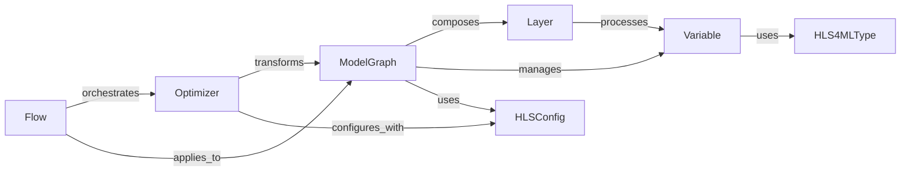

## Details

The hls4ml.model subsystem forms the core of the HLS4ML project, providing a robust framework for representing, optimizing, and configuring neural network models for High-Level Synthesis. At its heart is the ModelGraph, a directed graph that meticulously captures the network's structure, including its Layer operations and the Variable data flowing between them. HLSConfig acts as the central configuration hub, dictating global and layer-specific HLS parameters that influence the entire conversion process. Optimizer components apply various transformations to the ModelGraph to enhance hardware efficiency, with their execution orchestrated by Flows, which define sequences of optimization passes. Finally, HLS4MLType ensures precise control over hardware resource utilization and numerical accuracy by defining custom data types for the Variables within the model. This interconnected architecture enables a flexible and powerful approach to converting deep learning models into efficient hardware implementations.

### ModelGraph
The core data structure representing the neural network as a directed graph. It encapsulates layers, variables, and their interconnections, serving as the primary hub for all transformations and optimizations.

**Related Classes/Methods**:

- <a href="https://github.com/fastmachinelearning/hls4ml/blob/main/hls4ml/model/graph.py#L401-L1035" target="_blank" rel="noopener noreferrer">`hls4ml.model.graph.ModelGraph`:401-1035</a>
- <a href="https://github.com/fastmachinelearning/hls4ml/blob/main/hls4ml/model/graph.py" target="_blank" rel="noopener noreferrer">`hls4ml.model.graph.ModelGraph:from_layer_list`</a>
- <a href="https://github.com/fastmachinelearning/hls4ml/blob/main/hls4ml/model/graph.py" target="_blank" rel="noopener noreferrer">`hls4ml.model.graph.ModelGraph:compile`</a>
- <a href="https://github.com/fastmachinelearning/hls4ml/blob/main/hls4ml/model/graph.py" target="_blank" rel="noopener noreferrer">`hls4ml.model.graph.ModelGraph:write`</a>

### Layer
Represents individual computational operations or layers (e.g., Dense, Conv2D) within the neural network graph. These are the nodes of the ModelGraph.

**Related Classes/Methods**:

- <a href="https://github.com/fastmachinelearning/hls4ml/blob/main/hls4ml/model/layers.py" target="_blank" rel="noopener noreferrer">`hls4ml.model.layers.Layer`</a>

### Variable
Represents data tensors, weights, biases, or other parameters that flow between layers in the neural network. Each variable carries information about its shape, data type, and quantization.

**Related Classes/Methods**:

- <a href="https://github.com/fastmachinelearning/hls4ml/blob/main/hls4ml/model/types.py#L87-L116" target="_blank" rel="noopener noreferrer">`hls4ml.model.types.PrecisionType`:87-116</a>

### Optimizer
A set of components responsible for applying various graph transformations, optimizations (e.g., pruning, quantization, layer merging), and simplifications to the ModelGraph to improve hardware efficiency and performance.

**Related Classes/Methods**:

- <a href="https://github.com/fastmachinelearning/hls4ml/blob/main/hls4ml/model/optimizer/optimizer.py" target="_blank" rel="noopener noreferrer">`hls4ml.model.optimizer.Optimizer`</a>

### Flow
Represents the data or control flow within the ModelGraph, defining how operations are sequenced and how data propagates through the network. It can influence graph structure and execution order.

**Related Classes/Methods**:

- <a href="https://github.com/fastmachinelearning/hls4ml/blob/main/hls4ml/model/flow/flow.py" target="_blank" rel="noopener noreferrer">`hls4ml.model.flow.Flow`</a>

### HLS4MLType
Defines custom data types (e.g., fixed-point, arbitrary precision integers) specific to HLS, enabling precise control over hardware resource utilization and numerical accuracy for variables.

**Related Classes/Methods**:

- <a href="https://github.com/fastmachinelearning/hls4ml/blob/main/hls4ml/model/types.py" target="_blank" rel="noopener noreferrer">`hls4ml.model.types.HLS4MLType`</a>

### HLSConfig
Stores global and layer-specific configuration parameters for the HLS process, including target FPGA, clock frequency, I/O types, and optimization settings, guiding the transformation process.

**Related Classes/Methods**:

- <a href="https://github.com/fastmachinelearning/hls4ml/blob/main/hls4ml/model/graph.py" target="_blank" rel="noopener noreferrer">`hls4ml.model.hls_model.HLSConfig`</a>

### [FAQ](https://github.com/CodeBoarding/GeneratedOnBoardings/tree/main?tab=readme-ov-file#faq)