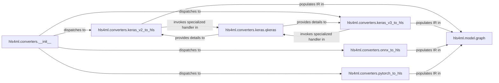

## Details

The `hls4ml.converters` subsystem is responsible for transforming deep learning models from various frameworks into a unified Intermediate Representation (IR) managed by `hls4ml.model.graph`. The `hls4ml.converters.__init__` component acts as the central dispatcher, directing the conversion process to framework-specific adapters such as `hls4ml.converters.keras_v2_to_hls`, `hls4ml.converters.keras_v3_to_hls`, `hls4ml.converters.onnx_to_hls`, and `hls4ml.converters.pytorch_to_hls`. These adapters parse the input models, extract layer configurations and weights, and then populate the `hls4ml.model.graph` with the structured IR. Specialized handling for quantized Keras models is provided by `hls4ml.converters.keras.qkeras`, which assists the Keras converters in extracting quantization details. This structured IR in `hls4ml.model.graph` forms the basis for subsequent HLS transformations and optimizations.

### hls4ml.converters.__init__
Acts as the primary entry point for model conversion. It identifies the input model's framework (e.g., Keras, PyTorch, ONNX) and dispatches the conversion task to the appropriate framework-specific adapter. It also handles initial configuration and validation.

**Related Classes/Methods**:

- <a href="https://github.com/fastmachinelearning/hls4ml/blob/main/hls4ml/converters/__init__.py" target="_blank" rel="noopener noreferrer">`hls4ml.converters.__init__`</a>

### hls4ml.converters.keras_v2_to_hls
Parses Keras (version 2) models, extracting their architecture, layer configurations, and weights. It identifies and processes supported Keras layers, translating them into a generic layer representation.

**Related Classes/Methods**:

- <a href="https://github.com/fastmachinelearning/hls4ml/blob/main/hls4ml/converters/keras_v2_to_hls.py" target="_blank" rel="noopener noreferrer">`hls4ml.converters.keras_v2_to_hls`</a>

### hls4ml.converters.keras_v3_to_hls
Handles the parsing of Keras (version 3) models, accommodating its specific architectural details and extracting layer information. Similar to the V2 adapter but tailored for Keras 3.

**Related Classes/Methods**:

- <a href="https://github.com/fastmachinelearning/hls4ml/blob/main/hls4ml/converters/keras_v3_to_hls.py" target="_blank" rel="noopener noreferrer">`hls4ml.converters.keras_v3_to_hls`</a>

### hls4ml.converters.onnx_to_hls
Interprets ONNX model graphs, extracting nodes (layers), attributes, and initializers (weights). It performs ONNX-specific data extraction and sanitization, preparing the information for the IR.

**Related Classes/Methods**:

- <a href="https://github.com/fastmachinelearning/hls4ml/blob/main/hls4ml/converters/onnx_to_hls.py" target="_blank" rel="noopener noreferrer">`hls4ml.converters.onnx_to_hls`</a>

### hls4ml.converters.pytorch_to_hls
Processes PyTorch model definitions, extracting layer types, parameters, and connectivity. It translates PyTorch-specific constructs into a format consumable by the IR.

**Related Classes/Methods**:

- <a href="https://github.com/fastmachinelearning/hls4ml/blob/main/hls4ml/converters/pytorch_to_hls.py" target="_blank" rel="noopener noreferrer">`hls4ml.converters.pytorch_to_hls`</a>

### hls4ml.converters.keras.qkeras
Provides specialized logic for parsing and extracting quantization details from QKeras layers within Keras models. It extends the functionality of the Keras adapters.

**Related Classes/Methods**:

- <a href="https://github.com/fastmachinelearning/hls4ml/blob/main/hls4ml/converters/keras/qkeras.py" target="_blank" rel="noopener noreferrer">`hls4ml.converters.keras.qkeras`</a>

### hls4ml.model.graph
Represents the core Intermediate Representation (IR) of the neural network model within hls4ml. It is responsible for building and managing the graph structure that captures the layers, their configurations, and interconnections after parsing from various deep learning frameworks. This unified graph serves as the foundation for subsequent HLS (High-Level Synthesis) transformations and optimizations.

**Related Classes/Methods**:

- <a href="https://github.com/fastmachinelearning/hls4ml/blob/main/hls4ml/model/graph.py" target="_blank" rel="noopener noreferrer">`hls4ml.model.graph`</a>

### [FAQ](https://github.com/CodeBoarding/GeneratedOnBoardings/tree/main?tab=readme-ov-file#faq)