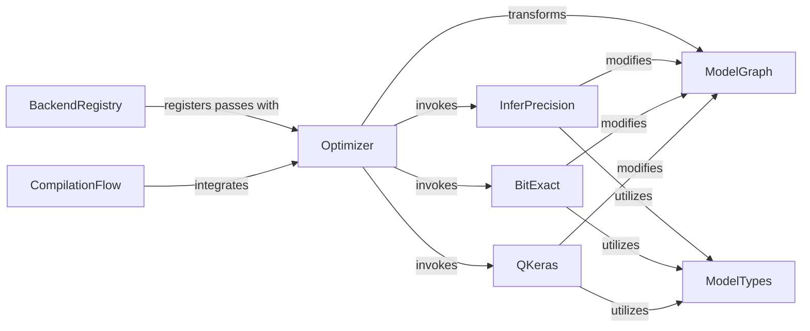

## Details

The `Optimization Engine` subsystem is a critical stage within the `hls4ml` compilation pipeline, responsible for applying various transformations to the Intermediate Representation (IR) to enhance the model for hardware implementation.

### Optimizer
The central orchestrator of the optimization process. It manages a registry of available passes and provides the main entry point (`optimize_model`) for applying these transformations to the `ModelGraph`.

**Related Classes/Methods**:

- <a href="https://github.com/fastmachinelearning/hls4ml/blob/main/hls4ml/model/optimizer/optimizer.py" target="_blank" rel="noopener noreferrer">`hls4ml/model/optimizer/optimizer.py`</a>

### ModelGraph
The core Intermediate Representation (IR) of the neural network model. All optimization passes within the `Optimization Engine` operate on and modify this graph structure.

**Related Classes/Methods**:

- <a href="https://github.com/fastmachinelearning/hls4ml/blob/main/hls4ml/model/graph.py" target="_blank" rel="noopener noreferrer">`hls4ml/model/graph.py`</a>

### InferPrecision
A specific, atomic transformation pass responsible for inferring and applying optimal data precision settings to layers and operations within the `ModelGraph`, crucial for hardware efficiency.

**Related Classes/Methods**:

- <a href="https://github.com/fastmachinelearning/hls4ml/blob/main/hls4ml/model/optimizer/passes/infer_precision.py" target="_blank" rel="noopener noreferrer">`hls4ml/model/optimizer/passes/infer_precision.py`</a>

### BitExact
A specialized transformation pass focused on ensuring bit-exactness of computations, which is vital for maintaining numerical fidelity when deploying models on hardware.

**Related Classes/Methods**:

- <a href="https://github.com/fastmachinelearning/hls4ml/blob/main/hls4ml/model/optimizer/passes/bit_exact.py" target="_blank" rel="noopener noreferrer">`hls4ml/model/optimizer/passes/bit_exact.py`</a>

### QKeras
An optimization pass specifically designed to handle and optimize models that originated from the QKeras framework, applying transformations relevant to quantized Keras models.

**Related Classes/Methods**:

- <a href="https://github.com/fastmachinelearning/hls4ml/blob/main/hls4ml/model/optimizer/passes/qkeras.py" target="_blank" rel="noopener noreferrer">`hls4ml/model/optimizer/passes/qkeras.py`</a>

### ModelTypes
Defines and manages custom data types, such as fixed-point types, used throughout the `hls4ml` compilation process. These types are fundamental for precision inference and bit-exactness passes.

**Related Classes/Methods**:

- <a href="https://github.com/fastmachinelearning/hls4ml/blob/main/hls4ml/model/types.py" target="_blank" rel="noopener noreferrer">`hls4ml/model/types.py`</a>

### BackendRegistry
Provides a mechanism for different hardware backends (e.g., Vivado HLS, Vitis HLS) to register their specific optimization passes with the `Optimizer`, allowing for backend-tailored optimization flows.

**Related Classes/Methods**:

- <a href="https://github.com/fastmachinelearning/hls4ml/blob/main/hls4ml/backends/backend.py" target="_blank" rel="noopener noreferrer">`hls4ml/backends/backend.py`</a>

### CompilationFlow
The overarching orchestrator of the entire `hls4ml` model transformation pipeline. It integrates and invokes the `Optimization Engine` as a distinct stage within the compilation process.

**Related Classes/Methods**:

- <a href="https://github.com/fastmachinelearning/hls4ml/blob/main/hls4ml/model/flow/flow.py" target="_blank" rel="noopener noreferrer">`hls4ml/model/flow/flow.py`</a>

### [FAQ](https://github.com/CodeBoarding/GeneratedOnBoardings/tree/main?tab=readme-ov-file#faq)