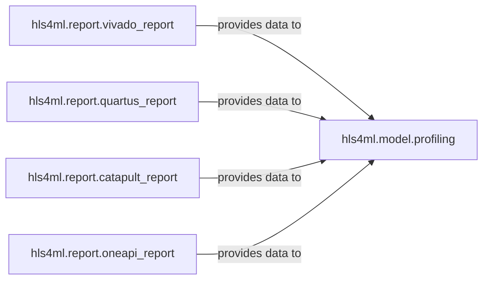

## Details

The `Profiling & Reporting` subsystem in `hls4ml` is crucial for evaluating the performance and numerical behavior of generated HLS models. It acts as the feedback loop, providing insights into resource utilization, latency, and the accuracy of the hardware implementation.

### hls4ml.report.vivado_report
Specializes in parsing and managing reports generated by Xilinx Vivado HLS. It extracts key metrics such as resource utilization, latency, and other performance indicators specific to Vivado's output format.

**Related Classes/Methods**:

- <a href="https://github.com/fastmachinelearning/hls4ml/blob/main/hls4ml/report/vivado_report.py" target="_blank" rel="noopener noreferrer">`hls4ml.report.vivado_report:read_vivado_report`</a>
- <a href="https://github.com/fastmachinelearning/hls4ml/blob/main/hls4ml/report/vivado_report.py" target="_blank" rel="noopener noreferrer">`hls4ml.report.vivado_report:print_vivado_report`</a>

### hls4ml.report.quartus_report
Handles the reading, parsing, and presentation of reports from Intel Quartus HLS. It is responsible for extracting relevant metrics from Quartus-specific report files.

**Related Classes/Methods**:

- <a href="https://github.com/fastmachinelearning/hls4ml/blob/main/hls4ml/report/quartus_report.py" target="_blank" rel="noopener noreferrer">`hls4ml.report.quartus_report:read_quartus_report`</a>
- <a href="https://github.com/fastmachinelearning/hls4ml/blob/main/hls4ml/report/quartus_report.py" target="_blank" rel="noopener noreferrer">`hls4ml.report.quartus_report:parse_quartus_report`</a>

### hls4ml.report.catapult_report
Manages reports from Mentor Catapult HLS. This includes parsing build scripts and extracting relevant information such as resource usage and timing from Catapult's output.

**Related Classes/Methods**:

- <a href="https://github.com/fastmachinelearning/hls4ml/blob/main/hls4ml/report/catapult_report.py" target="_blank" rel="noopener noreferrer">`hls4ml.report.catapult_report:read_catapult_report`</a>

### hls4ml.report.oneapi_report
Processes and presents reports generated by Intel oneAPI HLS. It focuses on parsing the specific format of oneAPI reports to extract performance and resource metrics.

**Related Classes/Methods**:

- <a href="https://github.com/fastmachinelearning/hls4ml/blob/main/hls4ml/report/oneapi_report.py" target="_blank" rel="noopener noreferrer">`hls4ml.report.oneapi_report:parse_oneapi_report`</a>
- <a href="https://github.com/fastmachinelearning/hls4ml/blob/main/hls4ml/report/oneapi_report.py" target="_blank" rel="noopener noreferrer">`hls4ml.report.oneapi_report:print_oneapi_report`</a>

### hls4ml.model.profiling
Provides a generic framework for analyzing the numerical behavior of HLS models. This includes evaluating precision, quantization effects, and comparing the HLS model's output with the original (e.g., Keras) model. It acts as the central aggregation point for report data.

**Related Classes/Methods**:

- <a href="https://github.com/fastmachinelearning/hls4ml/blob/main/hls4ml/model/profiling.py" target="_blank" rel="noopener noreferrer">`hls4ml.model.profiling:numerical`</a>
- <a href="https://github.com/fastmachinelearning/hls4ml/blob/main/hls4ml/model/profiling.py" target="_blank" rel="noopener noreferrer">`hls4ml.model.profiling:compare`</a>
- <a href="https://github.com/fastmachinelearning/hls4ml/blob/main/hls4ml/model/profiling.py" target="_blank" rel="noopener noreferrer">`hls4ml.model.profiling:get_ymodel_keras`</a>

### [FAQ](https://github.com/CodeBoarding/GeneratedOnBoardings/tree/main?tab=readme-ov-file#faq)