```mermaid
graph LR
    Model_Frontend_Input_Adapters_["Model Frontend (Input Adapters)"]
    Intermediate_Representation_IR_Core["Intermediate Representation (IR) Core"]
    Optimization_Engine["Optimization Engine"]
    HLS_Backends["HLS Backends"]
    Code_Generation_Project_Writer["Code Generation & Project Writer"]
    Profiling_Reporting["Profiling & Reporting"]
    Model_Frontend_Input_Adapters_ -- "converts models into" --> Intermediate_Representation_IR_Core
    Intermediate_Representation_IR_Core -- "provides IR to" --> Optimization_Engine
    Optimization_Engine -- "returns optimized IR to" --> Intermediate_Representation_IR_Core
    Intermediate_Representation_IR_Core -- "supplies IR to" --> HLS_Backends
    HLS_Backends -- "directs generation of files by" --> Code_Generation_Project_Writer
    click Model_Frontend_Input_Adapters_ href "https://github.com/CodeBoarding/GeneratedOnBoardings/blob/main/hls4ml/Model_Frontend_Input_Adapters_.md" "Details"
    click Intermediate_Representation_IR_Core href "https://github.com/CodeBoarding/GeneratedOnBoardings/blob/main/hls4ml/Intermediate_Representation_IR_Core.md" "Details"
    click Optimization_Engine href "https://github.com/CodeBoarding/GeneratedOnBoardings/blob/main/hls4ml/Optimization_Engine.md" "Details"
    click HLS_Backends href "https://github.com/CodeBoarding/GeneratedOnBoardings/blob/main/hls4ml/HLS_Backends.md" "Details"
    click Code_Generation_Project_Writer href "https://github.com/CodeBoarding/GeneratedOnBoardings/blob/main/hls4ml/Code_Generation_Project_Writer.md" "Details"
    click Profiling_Reporting href "https://github.com/CodeBoarding/GeneratedOnBoardings/blob/main/hls4ml/Profiling_Reporting.md" "Details"
```

## Details

The hls4ml project provides a comprehensive workflow for converting deep learning models into high-level synthesis (HLS) code for FPGAs. The process begins with the Model Frontend (Input Adapters), which ingests models from various ML frameworks and translates them into a unified Intermediate Representation (IR) Core. This IR is then passed to the Optimization Engine for hardware-aware transformations. The optimized IR is subsequently used by HLS Backends to guide the Code Generation & Project Writer, which produces the necessary HLS source files and project infrastructure. Finally, the Profiling & Reporting component analyzes the outputs from external HLS tools, providing crucial insights into hardware performance and resource utilization. This modular design ensures flexibility across different ML frameworks and FPGA vendor toolchains.

### Model Frontend (Input Adapters) [[Expand]](./Model_Frontend_Input_Adapters_.md)
Ingests and translates machine learning models from frameworks like Keras, PyTorch, and ONNX into hls4ml's framework-agnostic Intermediate Representation (IR). It handles model parsing, layer extraction, and initial configuration.

**Related Classes/Methods**:

- <a href="https://github.com/fastmachinelearning/hls4ml/blob/main/hls4ml/converters/__init__.py" target="_blank" rel="noopener noreferrer">`hls4ml.converters.__init__.convert_from_model`</a>
- <a href="https://github.com/fastmachinelearning/hls4ml/blob/main/hls4ml/converters/keras_v2_to_hls.py#L224-L345" target="_blank" rel="noopener noreferrer">`hls4ml.converters.keras_v2_to_hls.parse_keras_model`:224-345</a>
- <a href="https://github.com/fastmachinelearning/hls4ml/blob/main/hls4ml/converters/onnx_to_hls.py#L172-L264" target="_blank" rel="noopener noreferrer">`hls4ml.converters.onnx_to_hls.parse_onnx_model`:172-264</a>
- <a href="https://github.com/fastmachinelearning/hls4ml/blob/main/hls4ml/converters/pytorch_to_hls.py#L109-L422" target="_blank" rel="noopener noreferrer">`hls4ml.converters.pytorch_to_hls.parse_pytorch_model`:109-422</a>

### Intermediate Representation (IR) Core [[Expand]](./Intermediate_Representation_IR_Core.md)
The central data structure representing the neural network as a graph of layers, variables, and their associated attributes and data types. It serves as the hub for all transformations and optimizations.

**Related Classes/Methods**:

- <a href="https://github.com/fastmachinelearning/hls4ml/blob/main/hls4ml/model/graph.py#L421-L460" target="_blank" rel="noopener noreferrer">`hls4ml.model.graph.from_layer_list`:421-460</a>
- <a href="https://github.com/fastmachinelearning/hls4ml/blob/main/hls4ml/model/graph.py#L1301-L1303" target="_blank" rel="noopener noreferrer">`hls4ml.model.graph.compile`:1301-1303</a>
- <a href="https://github.com/fastmachinelearning/hls4ml/blob/main/hls4ml/model/graph.py#L1293-L1299" target="_blank" rel="noopener noreferrer">`hls4ml.model.graph.write`:1293-1299</a>

### Optimization Engine [[Expand]](./Optimization_Engine.md)
Applies various graph-level and layer-level transformations to the IR to optimize for hardware implementation. This includes precision inference, bit-exactness, and resource optimization passes.

**Related Classes/Methods**:

- <a href="https://github.com/fastmachinelearning/hls4ml/blob/main/hls4ml/model/optimizer/optimizer.py#L294-L329" target="_blank" rel="noopener noreferrer">`hls4ml.model.optimizer.optimizer.optimize_model`:294-329</a>
- <a href="https://github.com/fastmachinelearning/hls4ml/blob/main/hls4ml/model/optimizer/optimizer.py#L93-L95" target="_blank" rel="noopener noreferrer">`hls4ml.model.optimizer.optimizer.transform`:93-95</a>
- <a href="https://github.com/fastmachinelearning/hls4ml/blob/main/hls4ml/model/optimizer/passes/infer_precision.py#L34-L47" target="_blank" rel="noopener noreferrer">`hls4ml.model.optimizer.passes.infer_precision.transform`:34-47</a>
- <a href="https://github.com/fastmachinelearning/hls4ml/blob/main/hls4ml/model/optimizer/passes/bit_exact.py#L835-L876" target="_blank" rel="noopener noreferrer">`hls4ml.model.optimizer.passes.bit_exact.transform`:835-876</a>

### HLS Backends [[Expand]](./HLS_Backends.md)
Provides the foundational interface and specific implementations for generating HLS code compatible with different FPGA vendor tools (Xilinx Vivado/Vitis, Mentor Catapult, Intel OneAPI/Quartus). Each backend defines its specific code generation rules, HLS pragmas, and toolchain integration.

**Related Classes/Methods**:

- <a href="https://github.com/fastmachinelearning/hls4ml/blob/main/hls4ml/backends/backend.py#L18-L21" target="_blank" rel="noopener noreferrer">`hls4ml.backends.backend.__init__`:18-21</a>
- <a href="https://github.com/fastmachinelearning/hls4ml/blob/main/hls4ml/backends/vivado/vivado_backend.py#L43-L46" target="_blank" rel="noopener noreferrer">`hls4ml.backends.vivado.vivado_backend.__init__`:43-46</a>
- <a href="https://github.com/fastmachinelearning/hls4ml/blob/main/hls4ml/backends/vitis/vitis_backend.py#L21-L24" target="_blank" rel="noopener noreferrer">`hls4ml.backends.vitis.vitis_backend.__init__`:21-24</a>
- <a href="https://github.com/fastmachinelearning/hls4ml/blob/main/hls4ml/backends/catapult/catapult_backend.py#L40-L43" target="_blank" rel="noopener noreferrer">`hls4ml.backends.catapult.catapult_backend.__init__`:40-43</a>
- <a href="https://github.com/fastmachinelearning/hls4ml/blob/main/hls4ml/backends/oneapi/oneapi_backend.py#L20-L23" target="_blank" rel="noopener noreferrer">`hls4ml.backends.oneapi.oneapi_backend.__init__`:20-23</a>

### Code Generation & Project Writer [[Expand]](./Code_Generation_Project_Writer.md)
Responsible for writing all necessary files for the HLS project, including C++/SystemC source code, header files, weight data, test benches, and build scripts. It serializes the IR into hardware-description-language-specific files, leveraging backend-specific writers. The functions `write_project_cpp` and `write_test_bench` are internal operations typically invoked by higher-level writer functions like `write_hls` within specific backend implementations.

**Related Classes/Methods**:

- <a href="https://github.com/fastmachinelearning/hls4ml/blob/main/hls4ml/writer/vivado_writer.py#L1089-L1108" target="_blank" rel="noopener noreferrer">`hls4ml.writer.vivado_writer.write_hls`:1089-1108</a>

### Profiling & Reporting [[Expand]](./Profiling_Reporting.md)
Provides tools for analyzing the numerical behavior of the model and parsing reports generated by the HLS tools (e.g., resource utilization, latency). This component is crucial for performance evaluation and debugging.

**Related Classes/Methods**:

- <a href="https://github.com/fastmachinelearning/hls4ml/blob/main/hls4ml/report/vivado_report.py" target="_blank" rel="noopener noreferrer">`hls4ml.report.vivado_report.read_report`</a>

### [FAQ](https://github.com/CodeBoarding/GeneratedOnBoardings/tree/main?tab=readme-ov-file#faq)