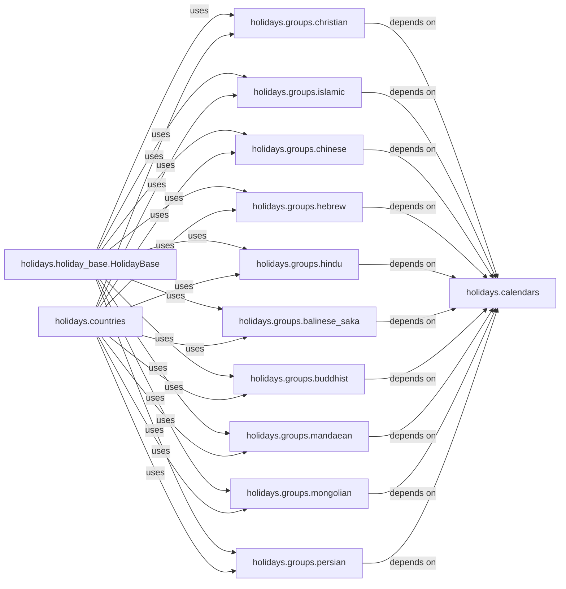

## Details

The Common Holiday Groups subsystem is a collection of modules designed to define and group holidays based on shared religious or cultural calendars. This promotes reusability of holiday definitions across various country or regional modules within the holidays library.

### holidays.groups.christian
Encapsulates logic and definitions for Christian holidays, providing methods to add them to a collection for reusability.

**Related Classes/Methods**:

- <a href="https://github.com/vacanza/holidays/blob/dev/holidays/groups/christian.py" target="_blank" rel="noopener noreferrer">`holidays.groups.christian`</a>

### holidays.groups.islamic
Encapsulates logic and definitions for Islamic holidays, providing methods to add them to a collection for reusability.

**Related Classes/Methods**:

- <a href="https://github.com/vacanza/holidays/blob/dev/holidays/groups/islamic.py" target="_blank" rel="noopener noreferrer">`holidays.groups.islamic`</a>

### holidays.groups.chinese
Encapsulates logic and definitions for Chinese holidays, providing methods to add them to a collection for reusability.

**Related Classes/Methods**:

- <a href="https://github.com/vacanza/holidays/blob/dev/holidays/groups/chinese.py" target="_blank" rel="noopener noreferrer">`holidays.groups.chinese`</a>

### holidays.groups.hebrew
Encapsulates logic and definitions for Hebrew holidays, providing methods to add them to a collection for reusability.

**Related Classes/Methods**:

- <a href="https://github.com/vacanza/holidays/blob/dev/holidays/groups/hebrew.py" target="_blank" rel="noopener noreferrer">`holidays.groups.hebrew`</a>

### holidays.groups.hindu
Encapsulates logic and definitions for Hindu holidays, providing methods to add them to a collection for reusability.

**Related Classes/Methods**:

- <a href="https://github.com/vacanza/holidays/blob/dev/holidays/groups/hindu.py" target="_blank" rel="noopener noreferrer">`holidays.groups.hindu`</a>

### holidays.groups.balinese_saka
Encapsulates logic and definitions for Balinese Saka holidays, providing methods to add them to a collection for reusability.

**Related Classes/Methods**:

- <a href="https://github.com/vacanza/holidays/blob/dev/holidays/groups/balinese_saka.py" target="_blank" rel="noopener noreferrer">`holidays.groups.balinese_saka`</a>

### holidays.groups.buddhist
Encapsulates logic and definitions for Buddhist holidays, providing methods to add them to a collection for reusability.

**Related Classes/Methods**:

- <a href="https://github.com/vacanza/holidays/blob/dev/holidays/groups/buddhist.py" target="_blank" rel="noopener noreferrer">`holidays.groups.buddhist`</a>

### holidays.groups.mandaean
Encapsulates logic and definitions for Mandaean holidays, providing methods to add them to a collection for reusability.

**Related Classes/Methods**:

- <a href="https://github.com/vacanza/holidays/blob/dev/holidays/groups/mandaean.py" target="_blank" rel="noopener noreferrer">`holidays.groups.mandaean`</a>

### holidays.groups.mongolian
Encapsulates logic and definitions for Mongolian holidays, providing methods to add them to a collection for reusability.

**Related Classes/Methods**:

- <a href="https://github.com/vacanza/holidays/blob/dev/holidays/groups/mongolian.py" target="_blank" rel="noopener noreferrer">`holidays.groups.mongolian`</a>

### holidays.groups.persian
Encapsulates logic and definitions for Persian holidays, providing methods to add them to a collection for reusability.

**Related Classes/Methods**:

- <a href="https://github.com/vacanza/holidays/blob/dev/holidays/groups/persian.py" target="_blank" rel="noopener noreferrer">`holidays.groups.persian`</a>

### holidays.holiday_base.HolidayBase
Base class for holiday definitions.

**Related Classes/Methods**:

- <a href="https://github.com/vacanza/holidays/blob/dev/holidays/holiday_base.py#L57-L1296" target="_blank" rel="noopener noreferrer">`holidays.holiday_base.HolidayBase`:57-1296</a>

### holidays.countries
Module for country-specific holiday definitions.

**Related Classes/Methods**:

- <a href="https://github.com/vacanza/holidays/blob/dev/holidays/countries/__init__.py" target="_blank" rel="noopener noreferrer">`holidays.countries`</a>

### holidays.calendars
Module for calendar-related date calculations.

**Related Classes/Methods**:

- <a href="https://github.com/vacanza/holidays/blob/dev/holidays/calendars" target="_blank" rel="noopener noreferrer">`holidays.calendars`</a>

### [FAQ](https://github.com/CodeBoarding/GeneratedOnBoardings/tree/main?tab=readme-ov-file#faq)