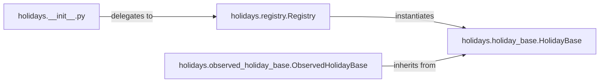

## Details

The `holidays` subsystem provides a robust and extensible framework for managing holiday calendars across various countries and subdivisions. Its core functionality revolves around the `Registry` component, which acts as a central factory for instantiating specific holiday calendars. These calendars are built upon the `HolidayBase` abstract class, defining the fundamental structure and operations for holiday management. The `ObservedHolidayBase` extends this foundation by incorporating specialized logic for handling observed holidays, ensuring accurate date adjustments based on weekend rules and other observation practices. The `__init__.py` module serves as the public interface, simplifying user interaction with the underlying holiday data and logic.

### holidays.__init__.py
This module serves as the primary public entry point for users interacting with the `holidays` library. It exposes the main `holidays` function or class, abstracting the underlying complexity of holiday retrieval and management. It acts as the public interface to the `Registry`, simplifying access to holiday data.

**Related Classes/Methods**:

- <a href="https://github.com/vacanza/holidays/blob/dev/holidays/registry.py" target="_blank" rel="noopener noreferrer">`holidays.registry.Registry`</a>

### holidays.registry.Registry
This is the central orchestrator of the subsystem. It is responsible for: Registration: Maintaining a collection of all available holiday definitions (e.g., country-specific holiday calendars). Instantiation (Factory): Creating instances of specific holiday calendars (e.g., `HolidayBase` or its subclasses) based on user requests (e.g., country code, year). Management: Providing a mechanism to retrieve and manage these holiday objects.

**Related Classes/Methods**:

- <a href="https://github.com/vacanza/holidays/blob/dev/holidays/holiday_base.py#L57-L1296" target="_blank" rel="noopener noreferrer">`holidays.holiday_base.HolidayBase`:57-1296</a>
- <a href="https://github.com/vacanza/holidays/blob/dev/holidays/observed_holiday_base.py#L102-L246" target="_blank" rel="noopener noreferrer">`holidays.observed_holiday_base.ObservedHolidayBase`:102-246</a>

### holidays.holiday_base.HolidayBase
This abstract class provides the foundational structure and core functionalities for any holiday calendar. It defines the interface for adding holidays, managing holiday names, and potentially handling localization. It serves as the base contract for all concrete holiday implementations (e.g., country-specific holiday classes).

**Related Classes/Methods**:

- <a href="https://github.com/vacanza/holidays/blob/dev/holidays/holiday_base.py#L57-L1296" target="_blank" rel="noopener noreferrer">`holidays.holiday_base.HolidayBase`:57-1296</a>

### holidays.observed_holiday_base.ObservedHolidayBase
This class extends `HolidayBase` to specifically encapsulate the logic for handling observed holidays. This includes rules for shifting holiday dates when they fall on non-working days (e.g., weekends), ensuring compliance with common observation practices.

**Related Classes/Methods**:

- <a href="https://github.com/vacanza/holidays/blob/dev/holidays/holiday_base.py#L57-L1296" target="_blank" rel="noopener noreferrer">`holidays.holiday_base.HolidayBase`:57-1296</a>
- <a href="https://github.com/vacanza/holidays/blob/dev/holidays/observed_holiday_base.py#L102-L246" target="_blank" rel="noopener noreferrer">`holidays.observed_holiday_base.ObservedHolidayBase`:102-246</a>

### [FAQ](https://github.com/CodeBoarding/GeneratedOnBoardings/tree/main?tab=readme-ov-file#faq)