```mermaid
graph LR
    Holiday_Core_Registry["Holiday Core & Registry"]
    Regional_Financial_Holiday_Definitions["Regional/Financial Holiday Definitions"]
    Common_Holiday_Groups["Common Holiday Groups"]
    Calendar_Calculation_Modules["Calendar Calculation Modules"]
    Public_API_Utilities["Public API & Utilities"]
    iCalendar_Export_Module["iCalendar Export Module"]
    Public_API_Utilities -- "requests holiday data from" --> Holiday_Core_Registry
    Holiday_Core_Registry -- "loads definitions from" --> Regional_Financial_Holiday_Definitions
    Regional_Financial_Holiday_Definitions -- "includes definitions from" --> Common_Holiday_Groups
    Regional_Financial_Holiday_Definitions -- "requests calculations from" --> Calendar_Calculation_Modules
    Common_Holiday_Groups -- "requests calculations from" --> Calendar_Calculation_Modules
    Holiday_Core_Registry -- "exports data to" --> iCalendar_Export_Module
    click Holiday_Core_Registry href "https://github.com/CodeBoarding/GeneratedOnBoardings/blob/main/holidays/Holiday_Core_Registry.md" "Details"
    click Regional_Financial_Holiday_Definitions href "https://github.com/CodeBoarding/GeneratedOnBoardings/blob/main/holidays/Regional_Financial_Holiday_Definitions.md" "Details"
    click Common_Holiday_Groups href "https://github.com/CodeBoarding/GeneratedOnBoardings/blob/main/holidays/Common_Holiday_Groups.md" "Details"
    click Calendar_Calculation_Modules href "https://github.com/CodeBoarding/GeneratedOnBoardings/blob/main/holidays/Calendar_Calculation_Modules.md" "Details"
```

## Details

The `holidays` library employs a modular architecture centered around a `Holiday Core & Registry` that orchestrates the retrieval and calculation of holiday data. User interactions flow through the `Public API & Utilities` to this core, which then dynamically loads specific `Regional/Financial Holiday Definitions`. These definitions are composed using reusable `Common Holiday Groups` and rely on specialized `Calendar Calculation Modules` for accurate date computations. The system is designed for extensibility, allowing new holiday sets and calendar systems to be integrated seamlessly. Finally, processed holiday data can be exported via the `iCalendar Export Module` for broader compatibility. This structure provides a clear data flow, from user request to data processing and eventual output, making it ideal for visual representation in a flow graph.

### Holiday Core & Registry [[Expand]](./Holiday_Core_Registry.md)
The central orchestrator responsible for initializing, registering, and managing all holiday definitions. It acts as a factory for holiday objects, handling the core logic of holiday observation and calculation.

**Related Classes/Methods**:

- <a href="https://github.com/vacanza/holidays/blob/dev/holidays/__init__.py" target="_blank" rel="noopener noreferrer">`holidays/__init__.py`</a>
- <a href="https://github.com/vacanza/holidays/blob/dev/holidays/holiday_base.py" target="_blank" rel="noopener noreferrer">`holidays/holiday_base.py`</a>
- <a href="https://github.com/vacanza/holidays/blob/dev/holidays/observed_holiday_base.py" target="_blank" rel="noopener noreferrer">`holidays/observed_holiday_base.py`</a>
- <a href="https://github.com/vacanza/holidays/blob/dev/holidays/registry.py" target="_blank" rel="noopener noreferrer">`holidays/registry.py`</a>

### Regional/Financial Holiday Definitions [[Expand]](./Regional_Financial_Holiday_Definitions.md)
Modules that encapsulate the specific public, optional, and subdivision holidays for individual countries or financial markets. These modules define the actual holiday rules and data.

**Related Classes/Methods**:

- <a href="https://github.com/vacanza/holidays/blob/dev/holidays/countries/" target="_blank" rel="noopener noreferrer">`holidays/countries/`</a>
- <a href="https://github.com/vacanza/holidays/blob/dev/holidays/financial/" target="_blank" rel="noopener noreferrer">`holidays/financial/`</a>

### Common Holiday Groups [[Expand]](./Common_Holiday_Groups.md)
Modules that define and group holidays based on shared religious or cultural calendars (e.g., Christian, Islamic, Chinese). This component promotes reusability of holiday definitions across multiple country or regional modules.

**Related Classes/Methods**:

- <a href="https://github.com/vacanza/holidays/blob/dev/holidays/groups/" target="_blank" rel="noopener noreferrer">`holidays/groups/`</a>

### Calendar Calculation Modules [[Expand]](./Calendar_Calculation_Modules.md)
A collection of specialized modules, each implementing algorithms for calculating dates based on specific calendar systems (e.g., Gregorian, Islamic, Chinese, Hebrew). These modules are fundamental for accurate holiday date determination.

**Related Classes/Methods**:

- <a href="https://github.com/vacanza/holidays/blob/dev/holidays/calendars/" target="_blank" rel="noopener noreferrer">`holidays/calendars/`</a>

### Public API & Utilities
The external interface of the library, providing user-friendly functions and utility methods to interact with the holiday data. This component simplifies access to holiday information and supports common operations.

**Related Classes/Methods**:

- <a href="https://github.com/vacanza/holidays/blob/dev/holidays/utils.py" target="_blank" rel="noopener noreferrer">`holidays/utils.py`</a>

### iCalendar Export Module
A dedicated component responsible for converting calculated holiday data into the iCalendar format. This facilitates seamless integration with external calendar applications and services.

**Related Classes/Methods**:

- <a href="https://github.com/vacanza/holidays/blob/dev/holidays/ical.py" target="_blank" rel="noopener noreferrer">`holidays/ical.py`</a>

### [FAQ](https://github.com/CodeBoarding/GeneratedOnBoardings/tree/main?tab=readme-ov-file#faq)