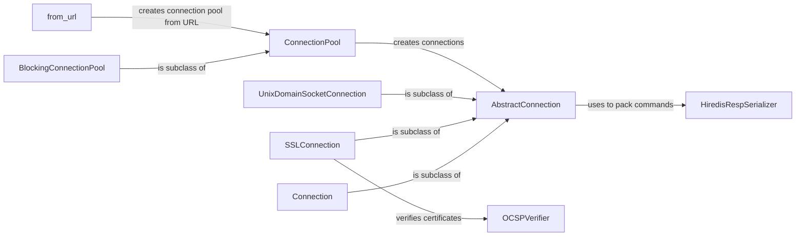

## Component Details

The Connection Management subsystem in redis-py is responsible for establishing and maintaining connections to Redis servers. It provides different connection types (TCP, SSL, Unix sockets), connection pooling for efficient resource utilization, and handles authentication and security aspects like SSL/TLS certificate verification. The core components abstract the underlying socket communication and provide a consistent interface for interacting with Redis.

### AbstractConnection
Abstract base class defining the interface for all connection types. It provides the foundation for connection management, including connecting, disconnecting, sending commands, and receiving responses. It also includes error handling and connection health checks.
- **Related Classes/Methods**: `redis.connection.AbstractConnection`, `redis.asyncio.connection.AbstractConnection`

### Connection
A concrete connection implementation that extends AbstractConnection and provides a standard TCP socket connection to a Redis server. It handles the low-level details of socket creation, connecting to the server, and sending/receiving data.
- **Related Classes/Methods**: `redis.connection.Connection`, `redis.asyncio.connection.Connection`

### SSLConnection
A secure connection implementation that extends AbstractConnection and provides SSL/TLS encryption for communication with a Redis server. It handles the SSL handshake, encryption/decryption of data, and certificate verification.
- **Related Classes/Methods**: `redis.connection.SSLConnection`, `redis.asyncio.connection.SSLConnection`

### UnixDomainSocketConnection
A connection implementation that extends AbstractConnection and connects to a Redis server using a Unix domain socket. This provides a file-based inter-process communication mechanism for local connections.
- **Related Classes/Methods**: `redis.connection.UnixDomainSocketConnection`, `redis.asyncio.connection.UnixDomainSocketConnection`

### ConnectionPool
Manages a pool of connections to a Redis server. It handles connection creation, release, and health checks, allowing for efficient reuse of connections and reducing the overhead of creating new connections for each request. It also supports different connection types, such as TCP, SSL, and Unix domain sockets.
- **Related Classes/Methods**: `redis.connection.ConnectionPool`, `redis.asyncio.connection.ConnectionPool`

### BlockingConnectionPool
A specialized connection pool that blocks when all connections are in use, waiting for a connection to become available. This ensures that a connection is always available, but can lead to blocking if the pool is exhausted.
- **Related Classes/Methods**: `redis.connection.BlockingConnectionPool`, `redis.asyncio.connection.BlockingConnectionPool`

### HiredisRespSerializer
A serializer that uses the hiredis library to pack commands for sending to the Redis server. Hiredis is a high-performance C library for parsing the Redis protocol, which improves the performance of command serialization.
- **Related Classes/Methods**: `redis.connection.HiredisRespSerializer`

### from_url
A utility function that creates a Redis client or connection pool from a URL string. This simplifies the configuration of Redis connections by allowing users to specify connection parameters in a standard URL format.
- **Related Classes/Methods**: `redis.utils:from_url`, `redis.connection.ConnectionPool:from_url`, `redis.asyncio.connection.ConnectionPool:from_url`

### OCSPVerifier
A class that handles OCSP (Online Certificate Status Protocol) verification of SSL/TLS certificates, ensuring that the certificates are still valid and have not been revoked. This enhances the security of SSL/TLS connections.
- **Related Classes/Methods**: `redis.ocsp.OCSPVerifier`, `redis.ocsp:_verify_response`, `redis.ocsp:_check_certificate`, `redis.ocsp:_get_certificates`, `redis.ocsp:ocsp_staple_verifier`
