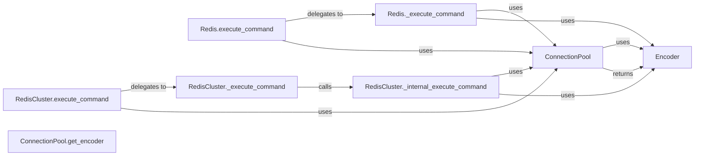

## Component Details

The data transformation process in redis-py involves encoding Python objects into a byte format suitable for storage and transmission to the Redis server, and decoding the data back into Python objects when retrieved. This process is crucial for ensuring data integrity and compatibility between the client and the server. The core components involved in this process are the Encoder, ConnectionPool, and the execute_command methods in both Redis and RedisCluster clients. The Encoder handles the actual serialization and deserialization, while the ConnectionPool manages the connection to the Redis server and provides the appropriate encoder. The execute_command methods serve as the entry points for executing Redis commands and utilize the encoder to prepare the commands for execution.

### Encoder
The Encoder class is responsible for encoding Python objects into bytes before they are sent to the Redis server. It provides methods for handling various data types and ensures that the data is in the correct format for Redis to understand. It handles the serialization and deserialization of data.
- **Related Classes/Methods**: `redis._parsers.encoders.Encoder`

### ConnectionPool
The ConnectionPool manages a pool of connections to the Redis server. It is responsible for providing a connection to the client when it needs to execute a command. It also holds a reference to the encoder that will be used to encode commands before they are sent to the server. It provides access to the encoder.
- **Related Classes/Methods**: `redis.connection.ConnectionPool`

### Redis.execute_command
The entry point for executing Redis commands on a standard Redis client. It prepares the command and arguments for execution by using the encoder from the connection pool. It delegates the actual execution to `Redis._execute_command`.
- **Related Classes/Methods**: `redis.client.Redis:execute_command`

### Redis._execute_command
Handles the actual execution of a Redis command on a standard Redis client. This includes connection management, command encoding using the encoder from the connection pool, sending the command to the server, and receiving the response. It uses the encoder from the connection pool to encode the command.
- **Related Classes/Methods**: `redis.client.Redis:_execute_command`

### RedisCluster.execute_command
The entry point for executing Redis commands on a Redis Cluster client. It determines the appropriate node in the cluster to send the command to. It delegates the actual execution to `RedisCluster._execute_command`.
- **Related Classes/Methods**: `redis.cluster.RedisCluster:execute_command`

### RedisCluster._execute_command
Handles the execution of a Redis command on a Redis Cluster client. It selects the node, and calls `_internal_execute_command`.
- **Related Classes/Methods**: `redis.cluster.RedisCluster:_execute_command`

### RedisCluster._internal_execute_command
Executes a Redis command on a specific node within the Redis Cluster. This function is used internally by `_execute_command` after the target node has been determined. It uses the encoder from the connection pool to encode the command.
- **Related Classes/Methods**: `redis.cluster.RedisCluster:_internal_execute_command`

### ConnectionPool.get_encoder
Retrieves the encoder used to serialize commands before sending them to Redis. The encoder is associated with the connection pool.
- **Related Classes/Methods**: `redis.connection.ConnectionPool:get_encoder`
