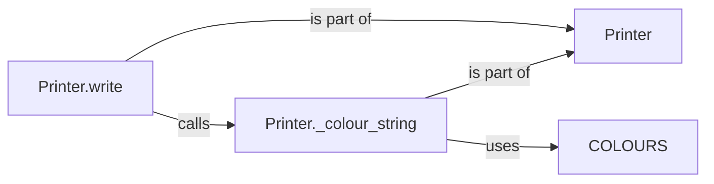

## Component Details

The Output Handler component in Honcho is responsible for managing and presenting the output from multiple processes in a clear and organized manner. It uses color-coding to differentiate between processes and highlight errors, ensuring that the console output is easily readable and informative. The core functionality revolves around the `Printer` class, which handles the actual writing to the console and the application of color formatting.

### Printer
The `Printer` class manages the output stream and applies color formatting to output strings. It encapsulates the logic for writing to the console and handling different output streams, including applying color codes based on the process and message type. It uses the `COLOURS` dictionary to map process names to color codes.
- **Related Classes/Methods**: `honcho.honcho.printer.Printer`

### Printer.write
The `write` method is responsible for writing the formatted output to the console. It receives the output string and any necessary formatting information, and then writes the string to the appropriate output stream. It calls `_colour_string` to apply color formatting before writing.
- **Related Classes/Methods**: `honcho.honcho.printer.Printer:write`

### Printer._colour_string
The `_colour_string` method applies color codes to the output string. It takes the output string and any relevant context (e.g., the type of message being printed) and returns a color-coded string. It uses `COLOURS` to determine the appropriate color code.
- **Related Classes/Methods**: `honcho.honcho.printer:_colour_string`

### COLOURS
The `COLOURS` dictionary stores the color codes used by `_colour_string` to format the output. It maps process names or message types to specific color codes.
- **Related Classes/Methods**: `honcho.honcho.printer`
