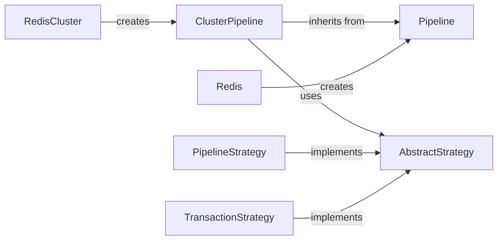

## Component Details

The Pipeline Management component in Redis allows for efficient execution of multiple commands by batching them into a single request, thereby minimizing network overhead. This component supports both transactional and non-transactional pipelines, catering to different consistency requirements. In a single Redis instance, the pipeline accumulates commands and sends them as a single batch to the Redis server. In a Redis Cluster, the pipeline handles routing commands to the correct nodes and executing the pipeline across multiple nodes, also managing transaction strategies for cluster environments.

### Pipeline
Handles pipelining of commands in a single Redis instance. It accumulates commands and sends them as a single batch to the Redis server. It also supports transactions using the MULTI, EXEC, and DISCARD commands.
- **Related Classes/Methods**: `redis.client.Pipeline`, `redis.asyncio.client.Pipeline`

### ClusterPipeline
Extends the pipeline functionality to Redis Cluster. It handles the routing of commands to the correct nodes in the cluster and executes the pipeline across multiple nodes. It also manages transaction strategies for cluster environments.
- **Related Classes/Methods**: `redis.cluster.ClusterPipeline`, `redis.asyncio.cluster.ClusterPipeline`

### AbstractStrategy
Defines the abstract base class for different execution strategies within a cluster pipeline, such as pipelined execution and transactional execution. It provides common methods for command execution and error handling.
- **Related Classes/Methods**: `redis.cluster.AbstractStrategy`

### PipelineStrategy
Implements the pipelined execution strategy for Redis Cluster. It sends commands to the appropriate nodes in the cluster and collects the responses.
- **Related Classes/Methods**: `redis.cluster.PipelineStrategy`

### TransactionStrategy
Implements the transactional execution strategy for Redis Cluster. It ensures that commands are executed atomically, even across multiple nodes in the cluster.
- **Related Classes/Methods**: `redis.cluster.TransactionStrategy`

### Redis
Represents a connection to a single Redis server. It provides methods for executing commands and managing the connection. The `pipeline` method creates a `redis.client.Pipeline` instance.
- **Related Classes/Methods**: `redis.client.Redis`

### RedisCluster
Represents a connection to a Redis Cluster. It provides methods for executing commands and managing the cluster connection. The `pipeline` method creates a `redis.cluster.ClusterPipeline` instance.
- **Related Classes/Methods**: `redis.cluster.RedisCluster`
