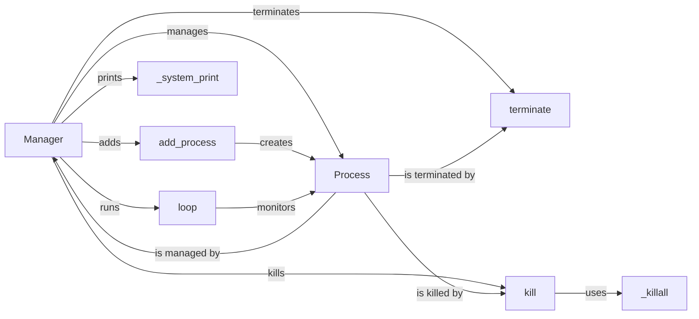

## Component Details

The Process Manager component, embodied primarily by the `Manager` class, orchestrates the lifecycle of multiple processes within the system. It handles process creation, monitoring, termination, and communication. The `Manager` maintains a registry of active processes, ensuring their proper execution and managing their output streams. The central loop continuously monitors the processes, restarting them if necessary. Termination and killing functionalities ensure graceful or forceful shutdown of managed processes.

### Manager
The `Manager` class is the core component responsible for managing and monitoring multiple processes. It provides methods for adding processes, starting them, stopping them, and restarting them. It maintains a registry of active processes and their states.
- **Related Classes/Methods**: `honcho.honcho.manager.Manager`

### add_process
The `add_process` method adds a new process to the manager's list of processes. It takes the process name, command, and other options as arguments, creating a `Process` instance and storing it for management.
- **Related Classes/Methods**: `honcho.honcho.manager.Manager:add_process`

### loop
The `loop` method is the main loop of the manager. It starts all the processes, monitors their status, and restarts them if they exit unexpectedly. It handles process output and errors, directing them to the appropriate streams.
- **Related Classes/Methods**: `honcho.honcho.manager.Manager:loop`

### terminate
The `terminate` method gracefully terminates all the processes managed by the manager by sending a SIGTERM signal to each process.
- **Related Classes/Methods**: `honcho.honcho.manager.Manager:terminate`

### kill
The `kill` method forcefully kills all the processes managed by the manager by sending a SIGKILL signal to each process.
- **Related Classes/Methods**: `honcho.honcho.manager.Manager:kill`

### _killall
The `_killall` method is a helper method that kills all processes in a process group. It's used internally by the `kill` method to ensure all child processes are terminated.
- **Related Classes/Methods**: `honcho.honcho.manager.Manager:_killall`

### _system_print
The `_system_print` method prints a message to the console with a timestamp. It's used for logging and debugging purposes.
- **Related Classes/Methods**: `honcho.honcho.manager.Manager:_system_print`

### Process
The `Process` class encapsulates the details of a single process being managed. It stores information such as the process name, command, and PID, and provides methods for starting, stopping, and monitoring the process.
- **Related Classes/Methods**: `honcho.process.Process`
