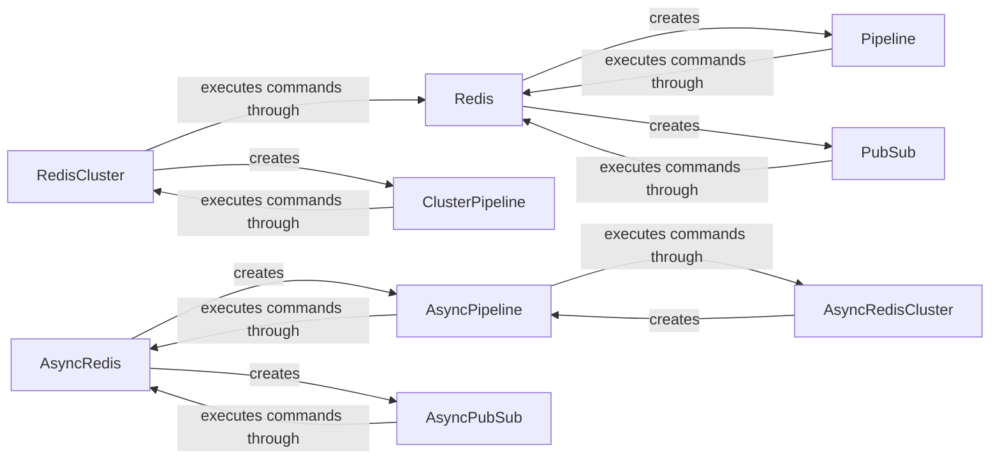

## Component Details

The Redis Client Interface provides a unified way to interact with Redis, supporting both single instances and clusters, in synchronous and asynchronous modes. It encapsulates connection management, command execution, and response parsing. Key functionalities include executing commands directly, batching commands using pipelines, and handling publish/subscribe messaging. The interface abstracts away the complexities of interacting with Redis, providing a simple and efficient way for users to leverage its features.

### Redis
Represents a connection to a single Redis server. It handles connection establishment, command execution, and response parsing. It provides methods for common Redis operations and supports features like pub/sub and transactions.
- **Related Classes/Methods**: `redis.client.Redis`

### Pipeline
Enables batching multiple commands into a single request to the Redis server, improving performance. It supports transactions with optimistic locking using WATCH/UNWATCH commands.
- **Related Classes/Methods**: `redis.client.Pipeline`

### PubSub
Provides functionality for publish/subscribe messaging with Redis. It allows clients to subscribe to channels and receive messages published to those channels.
- **Related Classes/Methods**: `redis.client.PubSub`

### RedisCluster
Represents a connection to a Redis cluster. It handles routing commands to the correct nodes in the cluster and provides methods for common Redis operations.
- **Related Classes/Methods**: `redis.cluster.RedisCluster`

### ClusterPipeline
Extends the Pipeline functionality for Redis clusters, allowing batching of commands across multiple nodes.
- **Related Classes/Methods**: `redis.cluster.ClusterPipeline`

### AsyncRedis
Asynchronous version of the Redis client for non-blocking operations.
- **Related Classes/Methods**: `redis.asyncio.client.Redis`

### AsyncPipeline
Asynchronous version of the Pipeline for non-blocking batched operations.
- **Related Classes/Methods**: `redis.asyncio.client.Pipeline`

### AsyncPubSub
Asynchronous version of the PubSub client for non-blocking publish/subscribe operations.
- **Related Classes/Methods**: `redis.asyncio.client.PubSub`

### AsyncRedisCluster
Asynchronous version of the RedisCluster client for non-blocking operations on Redis clusters.
- **Related Classes/Methods**: `redis.asyncio.cluster.RedisCluster`
