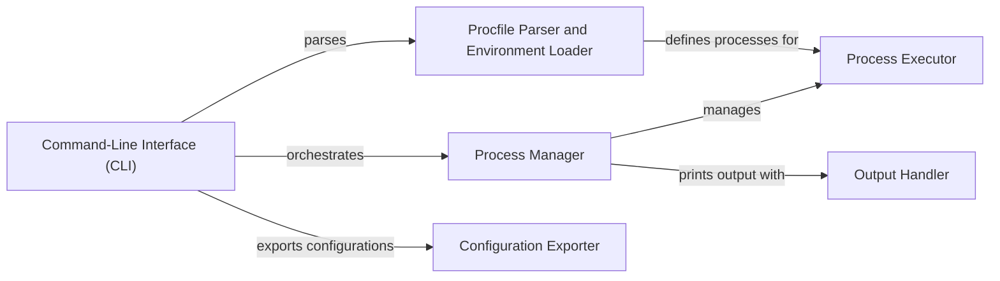

## Component Details

Honcho is a process manager designed to simplify the management of Procfile-based applications. It provides a command-line interface for starting, stopping, and monitoring processes defined in a Procfile, similar to Foreman. Honcho also supports exporting process configurations to various process management systems, enabling seamless integration with existing infrastructure. The core functionality revolves around parsing the Procfile, managing the lifecycle of individual processes, and handling their output.

### Command-Line Interface (CLI)
The CLI component serves as the entry point for user interaction. It parses command-line arguments, determines the appropriate action (e.g., start, run, export), and orchestrates the execution of other components. It provides commands for starting processes, exporting configurations, and checking the Procfile.
- **Related Classes/Methods**: `honcho.honcho.command:command_check`, `honcho.honcho.command:command_export`, `honcho.honcho.command:command_run`, `honcho.honcho.command:command_start`, `honcho.honcho.command:main`, `honcho.honcho.command:_procfile`, `honcho.honcho.command:_read_env`, `honcho.honcho.command:_choose_procfile`, `honcho.honcho.command:_mkdir`, `honcho.honcho.command:_write_file`

### Process Manager
The Process Manager component is responsible for managing the lifecycle of multiple processes. It starts, stops, and monitors processes, handles process termination, and facilitates communication between processes and the system. It maintains a registry of active processes and ensures their proper execution, including managing their output streams.
- **Related Classes/Methods**: `honcho.honcho.manager.Manager:__init__`, `honcho.honcho.manager.Manager:add_process`, `honcho.honcho.manager.Manager:loop`, `honcho.honcho.manager.Manager:terminate`, `honcho.honcho.manager.Manager:kill`, `honcho.honcho.manager.Manager:_killall`, `honcho.honcho.manager.Manager:_system_print`

### Process Executor
The Process Executor component is responsible for executing individual processes defined in the Procfile. It handles process startup, output redirection, and communication with the Process Manager. It encapsulates the details of running a process and ensures that it adheres to the specified configuration, including environment variables and command-line arguments.
- **Related Classes/Methods**: `honcho.honcho.process.Process:__init__`, `honcho.honcho.process.Process:run`, `honcho.honcho.process.Process:_send_message`

### Procfile Parser and Environment Loader
This component is responsible for parsing the Procfile to extract process definitions and environment variables. It transforms the Procfile content into a structured representation that can be used by other components. Additionally, it handles loading environment variables from .env files and expanding them for use by the processes.
- **Related Classes/Methods**: `honcho.honcho.environ:parse_procfile`, `honcho.honcho.environ:expand_processes`

### Output Handler
The Output Handler component is responsible for managing and displaying process output to the console. It handles color-coding, formatting, and synchronization of output from multiple processes, providing a clear and informative view of the application's activity. It ensures that output from different processes is interleaved correctly and that errors are highlighted.
- **Related Classes/Methods**: `honcho.honcho.printer.Printer:write`, `honcho.honcho.printer:_colour_string`

### Configuration Exporter
The Configuration Exporter component is responsible for exporting the process configuration to various process management systems, such as Supervisord, Runit, and Upstart. It translates the Procfile definitions into the specific format required by each system, enabling seamless integration with existing infrastructure. This allows Honcho to be used in conjunction with other process management tools.
- **Related Classes/Methods**: `honcho.honcho.export.supervisord.Export:render`, `honcho.honcho.export.runit.Export:render`, `honcho.honcho.export.base.BaseExport:__init__`, `honcho.honcho.export.upstart.Export:render`