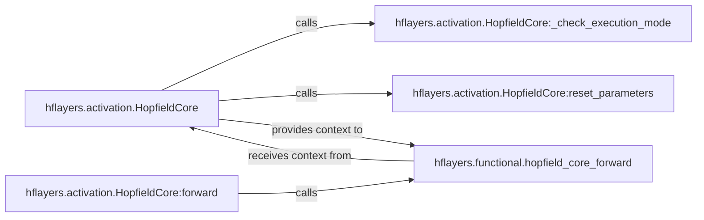

## Details

The `hflayers.activation.HopfieldCore` subsystem is central to the Hopfield network implementation, acting as a PyTorch module that encapsulates the core associative memory logic. During its initialization, `HopfieldCore` configures its operational parameters by calling `_check_execution_mode` to determine its static or dynamic behavior and `reset_parameters` to initialize its weights and biases. The primary interaction pathway for performing a Hopfield operation is through the `forward` method of `HopfieldCore`. This `forward` method directly invokes the stateless `hflayers.functional.hopfield_core_forward` function, passing all necessary contextual parameters (such as projection weights, biases, and configuration flags) from the `HopfieldCore` instance. This design clearly separates the stateful module management from the stateless computational core, allowing for flexible and efficient Hopfield network operations.

### hflayers.activation.HopfieldCore
Initializes and manages the foundational state and parameters of the Hopfield core, inheriting from `torch.nn.Module`. It sets up the necessary projections and biases for the Hopfield operations.

**Related Classes/Methods**:

- <a href="https://github.com/ml-jku/hopfield-layers/blob/master/hflayers/activation.py#L16-L339" target="_blank" rel="noopener noreferrer">`hflayers.activation.HopfieldCore`:16-339</a>

### hflayers.functional.hopfield_core_forward
Encapsulates the low-level, stateless mathematical and computational operations of the Hopfield association mechanism. This includes projections (query, key, value), attention calculations, and iterative updates, making it the core computational engine.

**Related Classes/Methods**:

- <a href="https://github.com/ml-jku/hopfield-layers/blob/master/hflayers/functional.py#L8-L453" target="_blank" rel="noopener noreferrer">`hflayers.functional.hopfield_core_forward`:8-453</a>

### hflayers.activation.HopfieldCore:forward
Orchestrates the overall forward pass for a Hopfield layer. It acts as the public interface for performing a Hopfield operation, directly invoking the core association logic by calling `hflayers.functional.hopfield_core_forward` with all necessary parameters.

**Related Classes/Methods**:

- <a href="https://github.com/ml-jku/hopfield-layers/blob/master/" target="_blank" rel="noopener noreferrer">`hflayers.activation.HopfieldCore:forward`</a>

### hflayers.activation.HopfieldCore:reset_parameters
Internal method called during initialization to set the initial values of the layer's weights and biases, ensuring proper starting conditions for the Hopfield operations.

**Related Classes/Methods**:

- <a href="https://github.com/ml-jku/hopfield-layers/blob/master/" target="_blank" rel="noopener noreferrer">`hflayers.activation.HopfieldCore:reset_parameters`</a>

### hflayers.activation.HopfieldCore:_check_execution_mode
Internal method called during initialization to determine and configure the execution mode of the Hopfield core, potentially influencing how computations are performed based on static or dynamic configurations.

**Related Classes/Methods**:

- <a href="https://github.com/ml-jku/hopfield-layers/blob/master/" target="_blank" rel="noopener noreferrer">`hflayers.activation.HopfieldCore:_check_execution_mode`</a>

### [FAQ](https://github.com/CodeBoarding/GeneratedOnBoardings/tree/main?tab=readme-ov-file#faq)