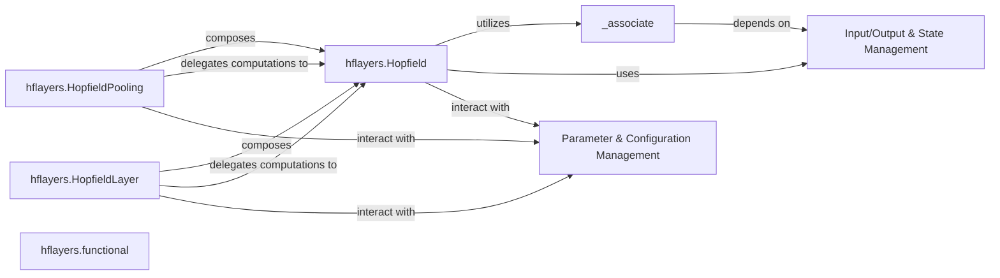

## Details

The Hopfield Layer subsystem is centered around providing PyTorch modules that implement various forms of Hopfield associative memory. Its boundaries are primarily defined by the hflayers Python package, encompassing the core Hopfield module, its specialized wrappers (HopfieldPooling, HopfieldLayer), and supporting functional components and internal utilities.

### hflayers.Hopfield
The foundational PyTorch module encapsulating the core Hopfield associative memory mechanism. It handles the iterative association process, pattern storage, and retrieval, serving as the primary building block for more complex Hopfield-based architectures.

**Related Classes/Methods**:

- <a href="https://github.com/ml-jku/hopfield-layers/blob/master/hflayers/__init__.py" target="_blank" rel="noopener noreferrer">`hflayers.Hopfield`</a>

### hflayers.HopfieldPooling
A specialized PyTorch module that utilizes the hflayers.Hopfield core module to perform Hopfield-based pooling. It incorporates a trainable, fixed state pattern for the pooling operation, designed as a drop-in replacement for standard pooling layers.

**Related Classes/Methods**:

- <a href="https://github.com/ml-jku/hopfield-layers/blob/master/hflayers/__init__.py" target="_blank" rel="noopener noreferrer">`hflayers.HopfieldPooling`</a>

### hflayers.HopfieldLayer
Another specialized PyTorch module that wraps the hflayers.Hopfield core module. It is designed for general Hopfield-based layer functionalities, potentially involving trainable stored patterns or pattern projections, providing a distinct interface for a Hopfield-based layer.

**Related Classes/Methods**:

- <a href="https://github.com/ml-jku/hopfield-layers/blob/master/hflayers/__init__.py" target="_blank" rel="noopener noreferrer">`hflayers.HopfieldLayer`</a>

### hflayers.functional
This component provides stateless, functional implementations of core Hopfield operations. It allows users to apply Hopfield computations directly without instantiating a torch.nn.Module, offering greater flexibility for custom model designs and integration into existing computational graphs.

**Related Classes/Methods**:

- <a href="https://github.com/ml-jku/hopfield-layers/blob/master/hflayers/functional.py" target="_blank" rel="noopener noreferrer">`hflayers.functional`</a>

### _associate
The central algorithmic component within hflayers.Hopfield that executes the iterative Hopfield associative memory recall process. This includes the core computations for pattern storage, retrieval, and transformation.

**Related Classes/Methods**:

- <a href="https://github.com/ml-jku/hopfield-layers/blob/master/hflayers/__init__.py" target="_blank" rel="noopener noreferrer">`hflayers.Hopfield:_associate`</a>

### Input/Output & State Management
A collection of internal methods (e.g., _prepare_input, Normalization Methods, State Retrieval Methods) responsible for validating and transforming input tensors into the correct format, applying various normalization schemes to patterns, and allowing users to inspect intermediate computational states or outputs.

**Related Classes/Methods**:

- <a href="https://github.com/ml-jku/hopfield-layers/blob/master/hflayers/__init__.py" target="_blank" rel="noopener noreferrer">`hflayers.Hopfield:Input/Output & State Management`</a>

### Parameter & Configuration Management
Internal methods and properties (e.g., reset_parameters, Configuration/Dimension Properties) that handle the initialization or re-initialization of learnable parameters (weights, biases) and define the architectural configuration and dimensions (e.g., input_size, hidden_size, output_size, scaling, batch_first) of the Hopfield layers.

**Related Classes/Methods**:

- <a href="https://github.com/ml-jku/hopfield-layers/blob/master/hflayers/__init__.py" target="_blank" rel="noopener noreferrer">`hflayers.Hopfield:Parameter & Configuration Management`</a>

### [FAQ](https://github.com/CodeBoarding/GeneratedOnBoardings/tree/main?tab=readme-ov-file#faq)