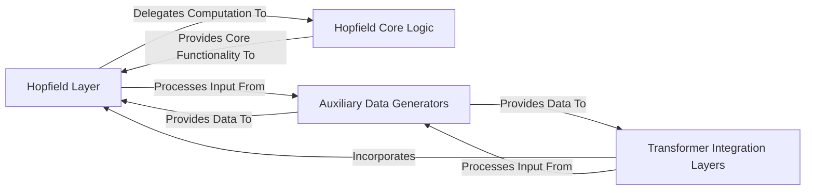

## Details

The `hopfield-layers` project is structured around a core `Hopfield Layer` that provides a PyTorch-compatible interface for associative memory. This layer offloads its complex mathematical operations to the `Hopfield Core Logic`, ensuring a clean and efficient implementation. For integration into modern deep learning models, particularly Transformers, the project offers `Transformer Integration Layers` that seamlessly embed the `Hopfield Layer` within standard encoder and decoder blocks. The entire system can be tested and demonstrated using synthetic data generated by the `Auxiliary Data Generators`, which supply inputs to both the standalone `Hopfield Layer` and the `Transformer Integration Layers`. This modular design promotes reusability, clear component responsibilities, and ease of integration into diverse neural network architectures.

### Hopfield Layer [[Expand]](./Hopfield_Layer.md)
The primary user-facing PyTorch module that encapsulates the Hopfield associative memory mechanism. It handles input/output normalization, parameter initialization, and orchestrates the core association process, designed as a drop-in replacement or enhancement for standard PyTorch layers.

**Related Classes/Methods**:

- <a href="https://github.com/ml-jku/hopfield-layers/blob/master/hflayers/__init__.py#L0-L1000" target="_blank" rel="noopener noreferrer">`hflayers.Hopfield`:0-1000</a>

### Hopfield Core Logic [[Expand]](./Hopfield_Core_Logic.md)
Encapsulates the fundamental mathematical and computational operations of the Hopfield association mechanism. This internal component performs low-level projections (query, key, value), attention calculations, and iterative updates, forming the heart of the associative memory behavior.

**Related Classes/Methods**:

- <a href="https://github.com/ml-jku/hopfield-layers/blob/master/hflayers/activation.py#L16-L339" target="_blank" rel="noopener noreferrer">`hflayers.activation.HopfieldCore`:16-339</a>
- <a href="https://github.com/ml-jku/hopfield-layers/blob/master/hflayers/functional.py#L8-L453" target="_blank" rel="noopener noreferrer">`hflayers.functional.hopfield_core_forward`:8-453</a>

### Transformer Integration Layers [[Expand]](./Transformer_Integration_Layers.md)
Specialized PyTorch modules (`HopfieldEncoderLayer`, `HopfieldDecoderLayer`) designed for seamless embedding of the Hopfield Layer into Transformer-based neural network architectures. These layers manage typical Transformer block functionalities while leveraging Hopfield mechanisms for attention.

**Related Classes/Methods**:

- <a href="https://github.com/ml-jku/hopfield-layers/blob/master/hflayers/transformer.py#L12-L98" target="_blank" rel="noopener noreferrer">`hflayers.transformer.HopfieldEncoderLayer`:12-98</a>
- <a href="https://github.com/ml-jku/hopfield-layers/blob/master/hflayers/transformer.py#L101-L212" target="_blank" rel="noopener noreferrer">`hflayers.transformer.HopfieldDecoderLayer`:101-212</a>

### Auxiliary Data Generators
Utility classes for generating specific synthetic data patterns (e.g., bit patterns, latch sequences). These datasets are primarily used for testing, demonstrating the capabilities of the Hopfield layers, and providing examples for users.

**Related Classes/Methods**:

- <a href="https://github.com/ml-jku/hopfield-layers/blob/master/hflayers/auxiliary/data.py#L0-L1000" target="_blank" rel="noopener noreferrer">`hflayers.auxiliary.data`:0-1000</a>

### [FAQ](https://github.com/CodeBoarding/GeneratedOnBoardings/tree/main?tab=readme-ov-file#faq)