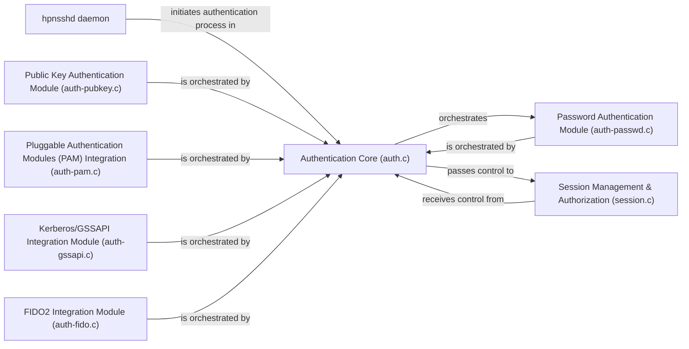

## Details

Architectural analysis of the hpnsshd project, detailing its C-language components and their relationships.

### hpnsshd daemon
The main server-side daemon responsible for listening for incoming connections and initiating the authentication process for clients. It acts as the entry point to the Authentication & Authorization Subsystem.

**Related Classes/Methods**: _None_

### Authentication Core (auth.c)
Serves as the central state machine for authentication, orchestrating the flow and dispatching requests to specific authentication modules based on configured methods and client requests. It manages the overall authentication session state.

**Related Classes/Methods**:

- `auth.c` (1:1)

### Password Authentication Module (auth-passwd.c)
Implements the logic for traditional password-based user authentication, verifying credentials against system or configured sources.

**Related Classes/Methods**:

- `auth-passwd.c` (1:1)

### Public Key Authentication Module (auth-pubkey.c)
Handles public key-based authentication, verifying user identity by challenging the client to prove possession of a private key corresponding to a registered public key.

**Related Classes/Methods**:

- `auth-pubkey.c` (1:1)

### Pluggable Authentication Modules (PAM) Integration (auth-pam.c)
Provides an interface to the system's Pluggable Authentication Modules (PAM) framework, allowing hpnsshd to leverage various system-wide authentication schemes configured via PAM.

**Related Classes/Methods**:

- `auth-pam.c` (1:1)

### Kerberos/GSSAPI Integration Module (auth-gssapi.c)
Integrates with Kerberos and Generic Security Service Application Programming Interface (GSSAPI) for robust, centralized authentication in enterprise environments.

**Related Classes/Methods**:

- `auth-gssapi.c` (1:1)

### FIDO2 Integration Module (auth-fido.c)
Supports FIDO2 security tokens for strong, hardware-backed authentication, enhancing security posture.

**Related Classes/Methods**:

- `auth-fido.c` (1:1)

### Session Management & Authorization (session.c)
Responsible for post-authentication tasks, including setting up user sessions, applying authorization policies, and preparing for shell or command execution based on user permissions.

**Related Classes/Methods**:

- `session.c` (1:1)

### [FAQ](https://github.com/CodeBoarding/GeneratedOnBoardings/tree/main?tab=readme-ov-file#faq)