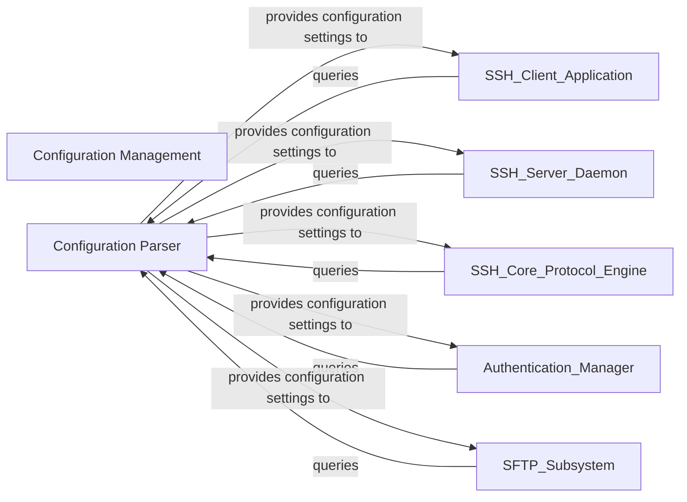

## Details

Analysis of the Configuration subsystem in a C-based SSH project, focusing on internal structure and interactions with external components.

### Configuration Management [[Expand]](./Configuration_Management.md)
Handles the parsing, loading, and application of configuration settings from files, allowing for flexible customization of both client and server behavior. This component likely encompasses the overall management and application of settings.

**Related Classes/Methods**:

- `config.c` (1:1)
- `config.h` (1:1)

### Configuration Parser
This component is responsible for reading, parsing, and validating configuration files (e.g., hpnssh_config, hpnsshd_config). It interprets various directives, loads the settings into an internal data structure, and makes them available for consumption by other parts of the system. It ensures that the system operates according to the specified user or administrator preferences.

**Related Classes/Methods**:

- `readconf.c` (1:1)
- `readconf.h` (1:1)

### [FAQ](https://github.com/CodeBoarding/GeneratedOnBoardings/tree/main?tab=readme-ov-file#faq)