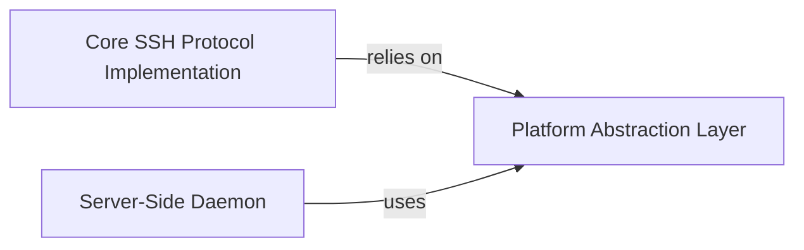

## Details

One paragraph explaining the functionality which is represented by this graph. What the main flow is and what is its purpose.

### Platform Abstraction Layer [[Expand]](./Platform_Abstraction_Layer.md)
This component provides a portable interface to operating system-specific functionalities, such as process management, file system access, and memory allocation, ensuring cross-platform compatibility for the HPN-SSH project. It abstracts away the underlying OS details, allowing higher-level components to interact with system resources in a standardized manner.

**Related Classes/Methods**: _None_

### Core SSH Protocol Implementation
This component is responsible for handling the fundamental aspects of the SSH protocol, including key exchange, authentication mechanisms, encryption, and data integrity. It ensures secure communication channels between the client and server by implementing the core SSH protocol specifications.

**Related Classes/Methods**: _None_

### Server-Side Daemon
This component operates as the main server process, listening for incoming SSH connections, managing client sessions, and orchestrating the authentication process. It acts as the entry point for clients and dispatches requests to other components for processing.

**Related Classes/Methods**: _None_

### [FAQ](https://github.com/CodeBoarding/GeneratedOnBoardings/tree/main?tab=readme-ov-file#faq)