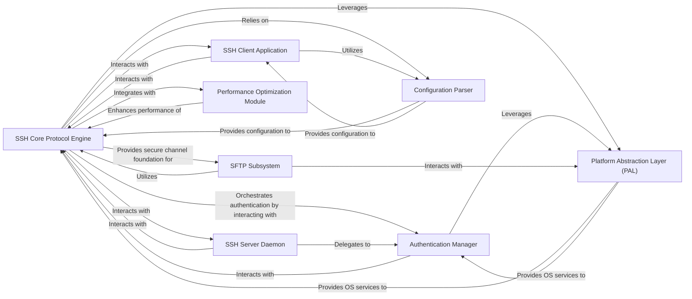

## Details

Abstract Components Overview of an HPN-SSH Project

### SSH Core Protocol Engine [[Expand]](./SSH_Core_Protocol_Engine.md)
The central component responsible for managing the fundamental SSH protocol state, including key exchange, encryption/decryption, data buffering, and network communication. It incorporates HPN-SSH performance enhancements and forms the secure communication channel.

**Related Classes/Methods**:

- `kex.c` (1:1)
- `cipher.c` (1:1)
- `packet.c` (1:1)
- `channels.c` (1:1)
- `auth.c` (1:1)

### SSH Client Application
The user-facing application (`hpnssh`, `hpnscp`, `hpnsftp`) that initiates SSH connections, handles user input, and presents output. It relies on the `SSH Core Protocol Engine` for secure communication.

**Related Classes/Methods**:

- `client.c` (1:1)
- `ssh.c` (1:1)
- `scp.c` (1:1)
- `sftp.c` (1:1)

### SSH Server Daemon
The background process (`hpnsshd`) that listens for incoming SSH connections, manages user authentication, and handles multiple concurrent sessions. It extensively uses the `SSH Core Protocol Engine` for protocol handling.

**Related Classes/Methods**:

- `sshd.c` (1:1)
- `server.c` (1:1)

### Authentication Manager
Manages various authentication methods (e.g., password, public key, PAM, Kerberos, FIDO2). It interacts with the `SSH Core Protocol Engine` to perform authentication challenges and verify credentials.

**Related Classes/Methods**:

- `auth.c` (1:1)
- `auth-options.c` (1:1)
- `auth2.c` (1:1)
- `monitor.c` (1:1)

### SFTP Subsystem
Implements the SSH File Transfer Protocol, allowing secure file transfers and remote file system management over an established SSH channel. It builds upon the secure communication provided by the `SSH Core Protocol Engine`.

**Related Classes/Methods**:

- `sftp.c` (1:1)
- `sftp-server.c` (1:1)

### Configuration Parser
Responsible for reading, parsing, and validating configuration files (e.g., `ssh_config`, `sshd_config`). It provides configuration parameters to various components, including the `SSH Core Protocol Engine`.

**Related Classes/Methods**:

- `readconf.c` (1:1)
- `misc.c` (1:1)

### Platform Abstraction Layer (PAL)
A layer that abstracts operating system-specific functionalities, providing a consistent interface for components like the `SSH Core Protocol Engine`, `Authentication Manager`, and `SFTP Subsystem`. This includes handling system calls, networking, and security features (e.g., sandboxing).

**Related Classes/Methods**:

- `compat.c` (1:1)
- `openbsd-compat.c` (1:1)

### Performance Optimization Module
Contains specific code and logic for HPN-SSH performance enhancements, such as receive buffer optimization and parallelized ciphers. It integrates directly with the `SSH Core Protocol Engine` to accelerate data transfer.

**Related Classes/Methods**:

- `packet.c` (1:1)
- `cipher.c` (1:1)
- `hpn-ssh-specific.c` (1:1)

### [FAQ](https://github.com/CodeBoarding/GeneratedOnBoardings/tree/main?tab=readme-ov-file#faq)