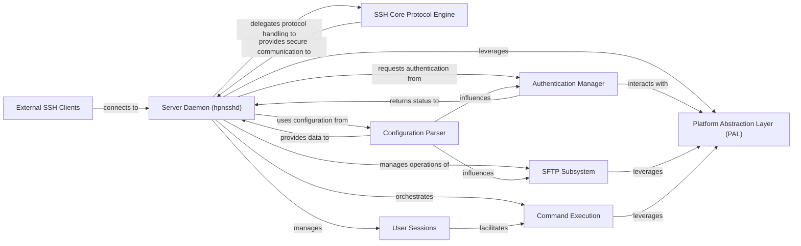

## Details

One paragraph explaining the functionality which is represented by this graph. What the main flow is and what is its purpose.

### Server Daemon (hpnsshd)
The primary server-side entry point. It initializes the SSH server, listens for incoming client connections, orchestrates secure session establishment, and manages the overall lifecycle of client interactions. It delegates core protocol handling, authentication, and specific service provision.

**Related Classes/Methods**:

- `sshd.c` (1:1)

### SSH Core Protocol Engine [[Expand]](./SSH_Core_Protocol_Engine.md)
Handles low-level SSH protocol operations, including key exchange, encryption, decryption, packet processing, and channel management. It provides the fundamental secure communication primitives for the Server Daemon.

**Related Classes/Methods**:

- `kex.c` (1:1)
- `cipher.c` (1:1)
- `channel.c` (1:1)

### Authentication Manager
Manages the client authentication processes, verifying client credentials against various configured methods (e.g., password, public key, PAM, FIDO2). It determines if a client is authorized to establish a session.

**Related Classes/Methods**:

- `auth.c` (1:1)
- `auth-options.c` (1:1)
- `auth-pam.c` (1:1)

### Configuration Parser
Parses and applies server-specific configurations from sshd_config and other related files. It provides runtime parameters for the Server Daemon and other components, influencing behavior like port listening, authentication methods, and security settings.

**Related Classes/Methods**:

- `readconf.c` (1:1)
- `sshd_config.c` (1:1)

### SFTP Subsystem
Provides secure file transfer services over the SSH protocol. It handles SFTP-specific commands, manages file system operations, and ensures data integrity and security during transfers.

**Related Classes/Methods**:

- `sftp-server.c` (1:1)

### Platform Abstraction Layer (PAL)
Provides a well-defined interface to abstract OS-specific functionalities. This includes system calls for process management, file system access, network I/O, privilege separation, sandboxing, and integration with system services like PAM.

**Related Classes/Methods**:

- `platform.c` (1:1)
- `compat.c` (1:1)
- `sandbox.c` (1:1)

### User Sessions
Manages the state and lifecycle of individual client sessions after successful authentication. This includes tracking session parameters, managing pseudo-terminals (PTYs), and handling session termination.

**Related Classes/Methods**:

- `session.c` (1:1)
- `session_pty.c` (1:1)

### Command Execution
Responsible for executing commands or shell sessions requested by authenticated clients. It handles process creation, I/O redirection, and ensures proper privilege separation and sandboxing for executed commands.

**Related Classes/Methods**:

- `exec.c` (1:1)
- `child.c` (1:1)

### External SSH Clients
Represents external SSH clients connecting to the server daemon.

**Related Classes/Methods**: _None_

### [FAQ](https://github.com/CodeBoarding/GeneratedOnBoardings/tree/main?tab=readme-ov-file#faq)