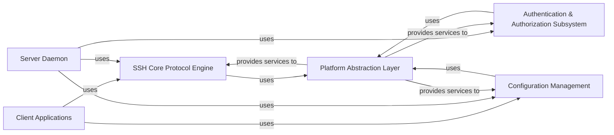

## Details

High-level architectural overview of the HPN-SSH project, which is primarily written in C.

### SSH Core Protocol Engine [[Expand]](./SSH_Core_Protocol_Engine.md)
The heart of HPN-SSH, responsible for managing the fundamental SSH protocol state, including key exchange, encryption/decryption, data buffering, and network communication, incorporating HPN-SSH performance enhancements.

**Related Classes/Methods**: _None_

### Client Applications
Provides the user-facing command-line tools (`hpnssh`, `hpnscp`, `hpnsftp`) for initiating SSH connections, secure file copying, and secure file transfer.

**Related Classes/Methods**: _None_

### Server Daemon [[Expand]](./Server_Daemon.md)
The central server component (`hpnsshd`) that listens for incoming SSH connections, manages client sessions, handles authentication, and executes commands or manages file transfers on the server side.

**Related Classes/Methods**: _None_

### Authentication & Authorization Subsystem [[Expand]](./Authentication_Authorization_Subsystem.md)
Manages various authentication methods (e.g., password, public key, PAM, Kerberos, FIDO2) and performs authorization checks for user access.

**Related Classes/Methods**: _None_

### Configuration Management [[Expand]](./Configuration_Management.md)
Handles the parsing, loading, and application of configuration settings from files, allowing for flexible customization of both client and server behavior.

**Related Classes/Methods**: _None_

### Platform Abstraction Layer [[Expand]](./Platform_Abstraction_Layer.md)
Provides a portable interface to operating system-specific functionalities, such as process management, file system access, and memory allocation, ensuring cross-platform compatibility.

**Related Classes/Methods**: _None_

### [FAQ](https://github.com/CodeBoarding/GeneratedOnBoardings/tree/main?tab=readme-ov-file#faq)