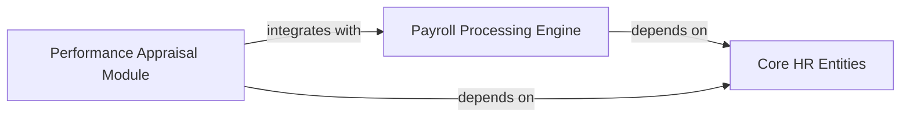

## Details

One paragraph explaining the functionality which is represented by this graph. What the main flow is and what is its purpose.

### Payroll Processing Engine
Handles salary calculations, deductions, and payroll generation.

**Related Classes/Methods**:

- `hrms.payroll.services.salary_calculator` (1:180)
- `hrms.models.employee.Employee` (1:210)

### Core HR Entities
Provides foundational employee data models and repositories for HR management.

**Related Classes/Methods**:

- `hrms.models.employee.Employee` (1:210)
- `hrms.repositories.employee.EmployeeRepository` (1:150)

### Performance Appraisal Module
Manages employee performance reviews, goals, and feedback cycles.

**Related Classes/Methods**:

- `hrms.performance.doctype.appraisal.appraisal` (1:160)
- `hrms.models.employee.Employee` (1:210)
- `hrms.payroll.services.salary_calculator` (1:180)

### [FAQ](https://github.com/CodeBoarding/GeneratedOnBoardings/tree/main?tab=readme-ov-file#faq)