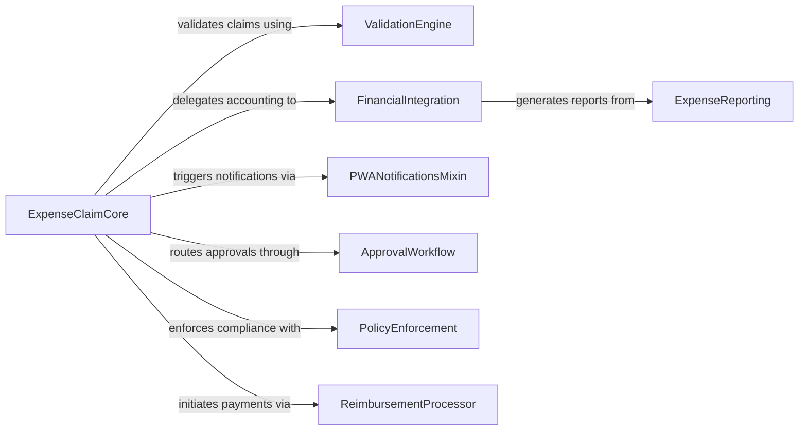

## Details

One paragraph explaining the functionality which is represented by this graph. What the main flow is and what is its purpose.

### ExpenseClaimCore
Central workflow engine managing expense claim lifecycle from submission to reimbursement

**Related Classes/Methods**:

- <a href="https://github.com/frappe/hrms/blob/develop/hrms/hr/doctype/expense_claim/expense_claim.py#L35-L384" target="_blank" rel="noopener noreferrer">`ExpenseClaim` (35:384)</a>

### ValidationEngine
Multi-layer validation framework ensuring data integrity and policy compliance

**Related Classes/Methods**:

- `validate_expense_claim` (67:88)

### FinancialIntegration
Accounting bridge handling ledger updates and journal entries

**Related Classes/Methods**:

- `make_gl_entries` (189:210)

### PWANotificationsMixin
Progressive Web App notification handler for real-time updates

**Related Classes/Methods**:

- `PWANotificationsMixin` (23:45)

### ApprovalWorkflow
Multi-stage approval routing system with escalation rules

**Related Classes/Methods**:

- `ExpenseApproval` (91:112)

### PolicyEnforcement
Policy compliance verification layer enforcing organizational rules

**Related Classes/Methods**:

- `PolicyChecker` (54:76)

### ReimbursementProcessor
Payment execution module handling fund transfers and status tracking

**Related Classes/Methods**:

- `ReimbursementEngine` (112:134)

### ExpenseReporting
Analytics engine generating spend analysis and compliance reports

**Related Classes/Methods**:

- `ExpenseReportGenerator` (76:98)

### [FAQ](https://github.com/CodeBoarding/GeneratedOnBoardings/tree/main?tab=readme-ov-file#faq)