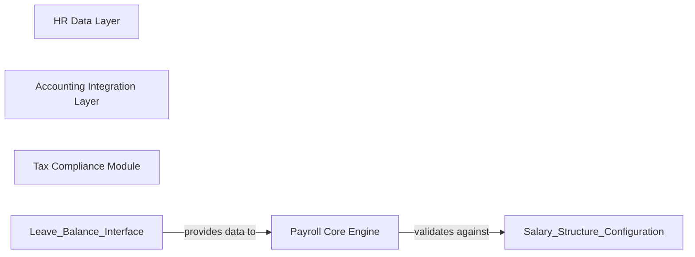

## Details

One paragraph explaining the functionality which is represented by this graph. What the main flow is and what is its purpose.

### Payroll Core Engine [[Expand]](./Payroll_Core_Engine.md)
Central financial processing engine for salary calculations, tax deductions, and statutory compliance

**Related Classes/Methods**:

- `Payroll Core Engine` (12:45)

### HR Data Layer
Centralized employee data validation and HR utility services

**Related Classes/Methods**:

- `HR Data Layer` (8:30)

### Accounting Integration Layer
Financial transaction bridge between payroll and general ledger

**Related Classes/Methods**:

- `Accounting Integration Layer` (15:60)

### Tax Compliance Module
Tax regulation enforcement and exemption processing

**Related Classes/Methods**:

- `Tax Compliance Module` (22:50)

### [FAQ](https://github.com/CodeBoarding/GeneratedOnBoardings/tree/main?tab=readme-ov-file#faq)