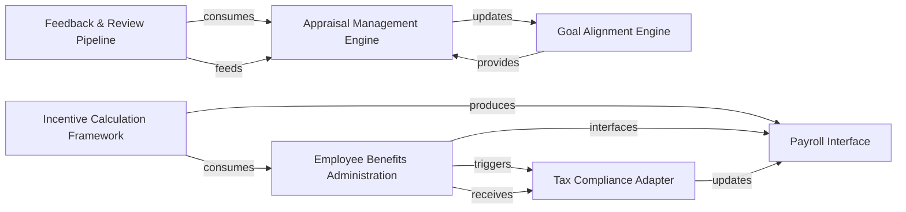

## Details

One paragraph explaining the functionality which is represented by this graph. What the main flow is and what is its purpose.

### Appraisal Management Engine
Core module for managing employee performance evaluations, KPI tracking, and rating calculations

**Related Classes/Methods**:

- `hrms.hr.doctype.appraisal.appraisal`

### Employee Benefits Administration
Handles benefit application processing, eligibility validation, and policy enforcement

**Related Classes/Methods**:

- `hrms.payroll.doctype.employee_benefit_application.employee_benefit_application`

### Goal Alignment Engine
Ensures performance metrics align with organizational objectives and cascading goal frameworks

**Related Classes/Methods**:

- `hrms.hr.doctype.goal.goal`

### Incentive Calculation Framework
Business logic layer for reward quantification based on performance metrics and organizational policies

**Related Classes/Methods**:

- `hrms.hr.utils.performance_calculations`

### Tax Compliance Adapter
Regulatory interface layer for statutory deduction calculations on incentive payments

**Related Classes/Methods**:

- `hrms.payroll.doctype.tax_compliance.tax_adapter` (5:28)

### Feedback & Review Pipeline
Multi-source feedback collection and analysis system for 360-degree performance views

**Related Classes/Methods**:

- `hrms.hr.doctype.performance_review.performance_review` (10:40)

### Payroll Interface
Integration layer for payroll system synchronization, handling payment instructions and compliance updates

**Related Classes/Methods**:

- `hrms.payroll.doctype.payroll_interface.payroll_interface` (3:25)

### [FAQ](https://github.com/CodeBoarding/GeneratedOnBoardings/tree/main?tab=readme-ov-file#faq)