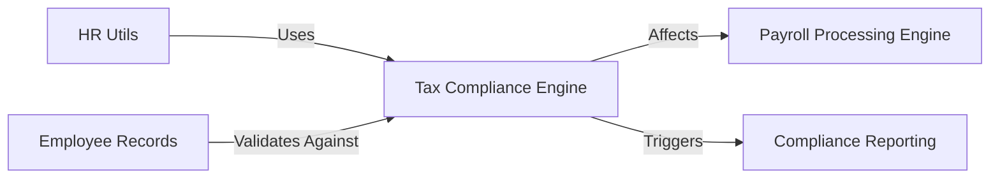

## Details

One paragraph explaining the functionality which is represented by this graph. What the main flow is and what is its purpose.

### Tax Compliance Engine [[Expand]](./Tax_Compliance_Engine.md)
Central component for tax compliance calculations and regulatory validation

**Related Classes/Methods**:

- `employee_tax_exemption_declaration.TaxExemptionDeclaration`
- `payroll_tax_exemption_declaration.TaxExemptionDeclaration` (150:180)

### HR Utils
Utility functions for tax calculations and employee data validation

**Related Classes/Methods**:

- `hr_utils.TaxCalculator` (60:85)

### Employee Records
Employee data repository for tax compliance validation

**Related Classes/Methods**:

- `employee.EmployeeRecords` (185:210)

### Payroll Processing Engine
Payroll calculation engine that incorporates tax compliance data

**Related Classes/Methods**:

- `salary_slip.PayrollEngine`

### Compliance Reporting
Regulatory reporting module for tax compliance data

**Related Classes/Methods**:

- `tax_compliance.ComplianceReporter` (85:110)

### [FAQ](https://github.com/CodeBoarding/GeneratedOnBoardings/tree/main?tab=readme-ov-file#faq)