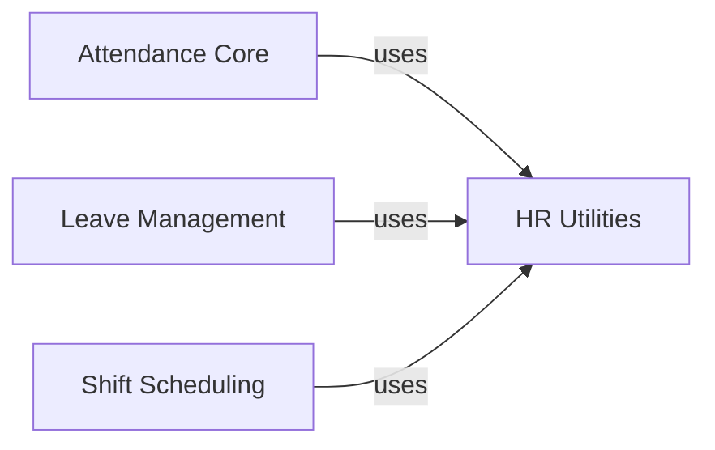

## Details

One paragraph explaining the functionality which is represented by this graph. What the main flow is and what is its purpose.

### Attendance Core
Central module for recording and validating employee attendance data

**Related Classes/Methods**:

- <a href="https://github.com/frappe/hrms/blob/develop/hrms/hr/doctype/attendance/attendance.py#L34-L236" target="_blank" rel="noopener noreferrer">`Attendance` (34:236)</a>

### Leave Management
Handles leave application lifecycle and policy enforcement

**Related Classes/Methods**:

- <a href="https://github.com/frappe/hrms/blob/develop/hrms/hr/doctype/leave_application/leave_application.py#L67-L849" target="_blank" rel="noopener noreferrer">`LeaveApplication` (67:849)</a>

### Shift Scheduling
Manages shift configurations and rotational schedules

**Related Classes/Methods**:

- <a href="https://github.com/frappe/hrms/blob/develop/hrms/hr/doctype/shift_type/shift_type.py#L27-L373" target="_blank" rel="noopener noreferrer">`ShiftType` (27:373)</a>

### HR Utilities
Shared functionality for date calculations and business rules

**Related Classes/Methods**:

### [FAQ](https://github.com/CodeBoarding/GeneratedOnBoardings/tree/main?tab=readme-ov-file#faq)