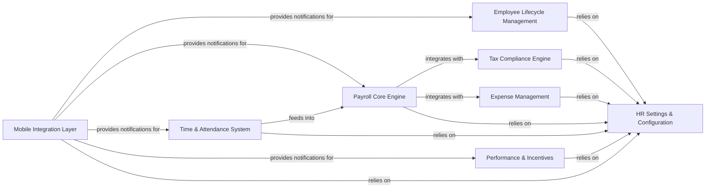

## Details

Updated analysis incorporating missing components and revised relationships. Key changes include explicit tax/expense components, removed invalid inheritance, and clarified mobile layer interactions while maintaining HR settings dependencies.

### Employee Lifecycle Management [[Expand]](./Employee_Lifecycle_Management.md)
Manages recruitment, onboarding, and separation workflows.

**Related Classes/Methods**:

- `hrms.hr.doctype.employee_onboarding.employee_onboarding`
- `hrms.hr.doctype.employee_separation.employee_separation`
- `hrms.hr.doctype.job_applicant.job_applicant`

### Payroll Core Engine [[Expand]](./Payroll_Core_Engine.md)
Central payroll calculations and core financial processing.

**Related Classes/Methods**:

- `hrms.hr.doctype.salary_slip.salary_slip` (180:200)
- `hrms.hr.doctype.employee_tax_exemption_declaration.employee_tax_exemption_declaration` (205:220)

### Time & Attendance System [[Expand]](./Time_Attendance_System.md)
Tracks attendance, leave applications, and shift scheduling.

**Related Classes/Methods**:

- `hrms.hr.doctype.attendance.attendance`
- `hrms.hr.doctype.leave_application.leave_application`
- `hrms.hr.doctype.shift_type.shift_type`

### Performance & Incentives [[Expand]](./Performance_Incentives.md)
Manages appraisals, goals, and employee benefits.

**Related Classes/Methods**:

- `hrms.hr.doctype.appraisal.appraisal`
- `hrms.hr.doctype.employee_benefit_application.employee_benefit_application` (285:300)

### Mobile Integration Layer
Enables PWA notifications and cross-component mobile workflows.

**Related Classes/Methods**:

- `hrms.hr.doctype.pwa_notifications_mixin.pwa_notifications_mixin` (285:300)

### HR Settings & Configuration
Centralized configuration for all HR modules.

**Related Classes/Methods**:

- <a href="https://github.com/frappe/hrms/blob/develop/hrms/hr/doctype/hr_settings/hr_settings.py#L305-L320" target="_blank" rel="noopener noreferrer">`hrms.hr.doctype.hr_settings.hr_settings` (305:320)</a>

### Tax Compliance Engine [[Expand]](./Tax_Compliance_Engine.md)
Handles tax calculations, compliance reporting, and regulatory updates.

**Related Classes/Methods**:

- `hrms.hr.doctype.employee_tax_exemption_declaration.employee_tax_exemption_declaration` (205:220)

### Expense Management [[Expand]](./Expense_Management.md)
Processes expense claims, reimbursement workflows, and policy validation.

**Related Classes/Methods**:

- `hrms.hr.doctype.expense_claim.expense_claim`

### [FAQ](https://github.com/CodeBoarding/GeneratedOnBoardings/tree/main?tab=readme-ov-file#faq)