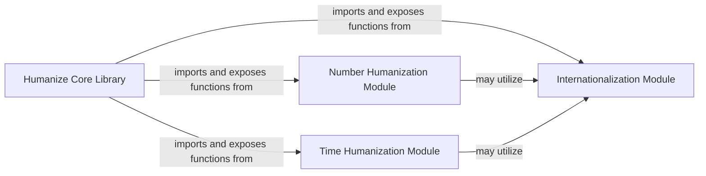

## Details

The `Humanize Core Library` subsystem is defined by the `src/humanize/__init__.py` file, which acts as the main entry point, aggregating and re-exporting functionalities from its specialized sub-modules. Its boundaries encompass all modules directly contributing to the humanization functions exposed to the end-user.

### Humanize Core Library [[Expand]](./Humanize_Core_Library.md)
The primary entry point and orchestrator of the `humanize` library. It provides a unified, user-friendly interface by importing and re-exporting humanization functions from specialized modules. This component embodies the "Functional/Procedural" pattern by centralizing access to various utility functions.

**Related Classes/Methods**:

- <a href="https://github.com/jmoiron/humanize/blob/master/src/humanize/__init__.py#L1-L1000" target="_blank" rel="noopener noreferrer">`humanize`:1-1000</a>

### Internationalization Module
Responsible for handling all internationalization (i18n) aspects of the humanization process. This includes managing locale-specific data, translations, and formatting rules to ensure humanized output is culturally appropriate. It aligns with the "Internationalization (I18n)" architectural pattern.

**Related Classes/Methods**:

- <a href="https://github.com/jmoiron/humanize/blob/master/src/humanize/i18n.py#L1-L1000" target="_blank" rel="noopener noreferrer">`humanize.i18n`:1-1000</a>

### Number Humanization Module [[Expand]](./Number_Humanization_Module.md)
Specializes in converting numerical values into more readable, human-friendly formats (e.g., "1000" to "1k", "1st", "2nd"). This module encapsulates all logic related to number formatting, adhering to the "Functional/Procedural" pattern for specific data types.

**Related Classes/Methods**:

- <a href="https://github.com/jmoiron/humanize/blob/master/src/humanize/number.py#L1-L1000" target="_blank" rel="noopener noreferrer">`humanize.number`:1-1000</a>

### Time Humanization Module [[Expand]](./Time_Humanization_Module.md)
Focuses on transforming time-related data (e.g., dates, durations) into easily understandable human language (e.g., "2 days ago", "in an hour"). This module centralizes time-specific formatting logic, following the "Functional/Procedural" pattern for time-based utilities.

**Related Classes/Methods**:

- <a href="https://github.com/jmoiron/humanize/blob/master/src/humanize/time.py#L1-L1000" target="_blank" rel="noopener noreferrer">`humanize.time`:1-1000</a>

### [FAQ](https://github.com/CodeBoarding/GeneratedOnBoardings/tree/main?tab=readme-ov-file#faq)