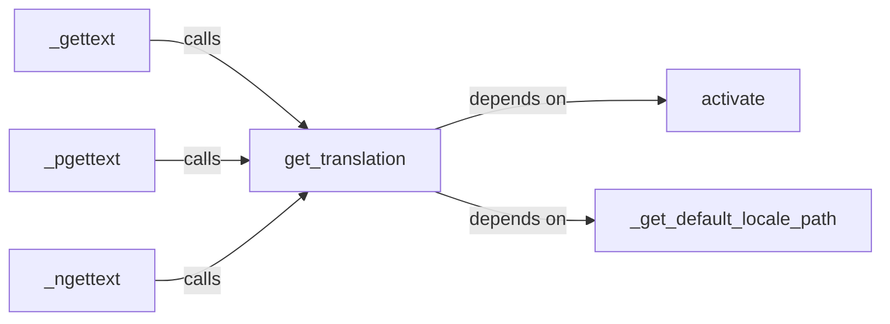

## Details

The Internationalization (I18n) Module subsystem is encapsulated within the src/humanize/i18n.py file. This module is responsible for all core localization and translation services, including managing active locales and retrieving translated strings based on the current language settings.

### activate
Manages the active locale for the application, determining and loading the appropriate translation environment. This function is crucial for setting up the correct language context for all subsequent translation operations.

**Related Classes/Methods**:

- <a href="https://github.com/jmoiron/humanize/blob/master/src/humanize/i18n.py#L34-L61" target="_blank" rel="noopener noreferrer">`activate`:34-61</a>

### get_translation
Provides the active translation object, acting as a central point for accessing loaded translations. This component serves as the primary interface for other translation functions to retrieve the necessary translation context.

**Related Classes/Methods**:

- <a href="https://github.com/jmoiron/humanize/blob/master/src/humanize/i18n.py#L27-L31" target="_blank" rel="noopener noreferrer">`get_translation`:27-31</a>

### _gettext
Retrieves the singular form of a translated string based on the current locale. This is a fundamental translation utility for simple string localization.

**Related Classes/Methods**:

- <a href="https://github.com/jmoiron/humanize/blob/master/src/humanize/i18n.py#L69-L78" target="_blank" rel="noopener noreferrer">`_gettext`:69-78</a>

### _pgettext
Retrieves a contextualized singular form of a translated string. This component handles cases where the same string might have different translations depending on its context, providing more precise localization.

**Related Classes/Methods**:

- <a href="https://github.com/jmoiron/humanize/blob/master/src/humanize/i18n.py#L81-L103" target="_blank" rel="noopener noreferrer">`_pgettext`:81-103</a>

### _ngettext
Retrieves the plural form of a translated string based on a given count and the locale's pluralization rules. This is essential for correctly handling grammatical number variations in different languages.

**Related Classes/Methods**:

- <a href="https://github.com/jmoiron/humanize/blob/master/src/humanize/i18n.py#L106-L118" target="_blank" rel="noopener noreferrer">`_ngettext`:106-118</a>

### _get_default_locale_path
Determines the default locale path for translation sources. This utility function ensures that the translation system can locate the necessary `.mo` or `.po` files.

**Related Classes/Methods**:

- <a href="https://github.com/jmoiron/humanize/blob/master/src/humanize/i18n.py#L18-L24" target="_blank" rel="noopener noreferrer">`_get_default_locale_path`:18-24</a>

### [FAQ](https://github.com/CodeBoarding/GeneratedOnBoardings/tree/main?tab=readme-ov-file#faq)