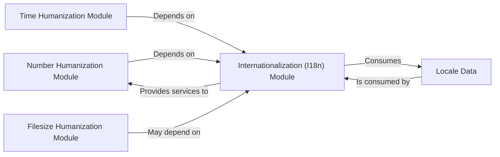

## Details

The humanize library is structured around several key modules, each responsible for transforming raw data into human-readable formats. The core of the library's adaptability lies in its Internationalization (I18n) Module, which manages locale-specific settings and relies on Locale Data for translation strings and formatting rules. Other specialized modules, such as Number Humanization, Time Humanization, and Filesize Humanization, leverage the I18n module to ensure their output is culturally and linguistically appropriate. This design promotes modularity and reusability, allowing each humanization type to focus on its specific formatting logic while centralizing internationalization concerns.

### Number Humanization Module [[Expand]](./Number_Humanization_Module.md)
This module is responsible for converting raw numerical data into human-readable string formats. It handles tasks such as adding comma separators to integers (intcomma) and converting numbers to their ordinal forms (ordinal).

**Related Classes/Methods**:

- <a href="https://github.com/jmoiron/humanize/blob/master/src/humanize/number.py" target="_blank" rel="noopener noreferrer">`src.humanize.number:intcomma`</a>
- <a href="https://github.com/jmoiron/humanize/blob/master/src/humanize/number.py" target="_blank" rel="noopener noreferrer">`src.humanize.number:ordinal`</a>

### Internationalization (I18n) Module [[Expand]](./Internationalization_I18n_Module.md)
This module provides the internationalization capabilities for the entire humanize library. It manages locale-specific settings and ensures that humanized output adheres to the linguistic and formatting conventions of the target locale. It uses the gettext module for translations.

**Related Classes/Methods**:

- <a href="https://github.com/jmoiron/humanize/blob/master/src/humanize/i18n.py" target="_blank" rel="noopener noreferrer">`src.humanize.i18n:activate`</a>
- <a href="https://github.com/jmoiron/humanize/blob/master/src/humanize/i18n.py" target="_blank" rel="noopener noreferrer">`src.humanize.i18n:deactivate`</a>
- <a href="https://github.com/jmoiron/humanize/blob/master/src/humanize/i18n.py" target="_blank" rel="noopener noreferrer">`src.humanize.i18n:get_translation`</a>
- <a href="https://github.com/jmoiron/humanize/blob/master/src/humanize/i18n.py" target="_blank" rel="noopener noreferrer">`src.humanize.i18n:_gettext`</a>
- <a href="https://github.com/jmoiron/humanize/blob/master/src/humanize/i18n.py" target="_blank" rel="noopener noreferrer">`src.humanize.i18n:_ngettext`</a>
- <a href="https://github.com/jmoiron/humanize/blob/master/src/humanize/i18n.py" target="_blank" rel="noopener noreferrer">`src.humanize.i18n:thousands_separator`</a>

### Time Humanization Module [[Expand]](./Time_Humanization_Module.md)
Dedicated to formatting time-related data (e.g., dates, durations, timestamps) into human-readable strings. It leverages the I18n module for localized output.

**Related Classes/Methods**:

- <a href="https://github.com/jmoiron/humanize/blob/master/src/humanize/time.py" target="_blank" rel="noopener noreferrer">`src.humanize.time:naturaldelta`</a>
- <a href="https://github.com/jmoiron/humanize/blob/master/src/humanize/time.py" target="_blank" rel="noopener noreferrer">`src.humanize.time:naturaltime`</a>
- <a href="https://github.com/jmoiron/humanize/blob/master/src/humanize/time.py" target="_blank" rel="noopener noreferrer">`src.humanize.time:naturalday`</a>
- <a href="https://github.com/jmoiron/humanize/blob/master/src/humanize/time.py" target="_blank" rel="noopener noreferrer">`src.humanize.time:naturaldate`</a>

### Filesize Humanization Module [[Expand]](./Filesize_Humanization_Module.md)
Focuses on converting raw file size values into human-readable formats (e.g., "1.5 MB", "200 KB").

**Related Classes/Methods**:

- <a href="https://github.com/jmoiron/humanize/blob/master/src/humanize/filesize.py" target="_blank" rel="noopener noreferrer">`src.humanize.filesize:naturalsize`</a>

### Locale Data
Represents the collection of language-specific strings, formatting rules, and other localization information (e.g., pluralization rules, date/time formats) that the I18n module utilizes. These are typically stored in Gettext .po files.

**Related Classes/Methods**: _None_

### [FAQ](https://github.com/CodeBoarding/GeneratedOnBoardings/tree/main?tab=readme-ov-file#faq)