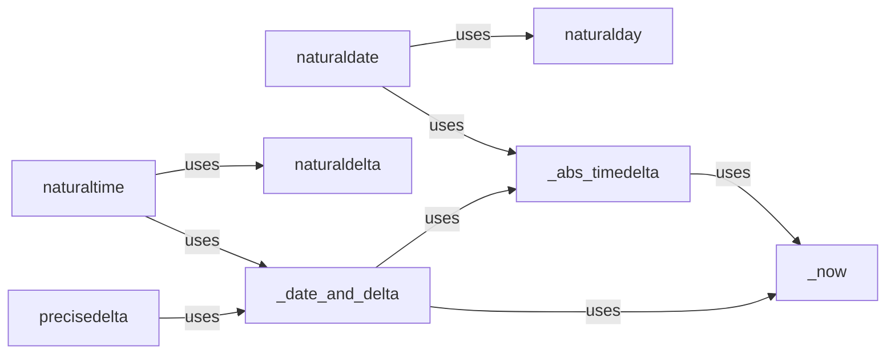

## Details

The `Time Humanization Module` is a core component of the `humanize` utility library, specifically designed to convert date and time objects into human-readable formats. It adheres to the project's architectural bias of organizing components by the type of data they humanize, with all its functionalities encapsulated within `src/humanize/time.py`.

### naturaltime
The main entry point for converting `datetime` or `timedelta` objects into human-readable relative time strings (e.g., "2 days ago", "in 3 hours"). It orchestrates the process of calculating time differences and formatting the output.

**Related Classes/Methods**:

- <a href="https://github.com/jmoiron/humanize/blob/master/src/humanize/time.py#L205-L244" target="_blank" rel="noopener noreferrer">`humanize.time.naturaltime`:205-244</a>

### naturaldate
The primary function for transforming `date` objects into human-readable relative date strings (e.g., "today", "yesterday", "on Jan 1st"). It focuses on date-specific humanization, often ignoring time components.

**Related Classes/Methods**:

- <a href="https://github.com/jmoiron/humanize/blob/master/src/humanize/time.py#L273-L286" target="_blank" rel="noopener noreferrer">`humanize.time.naturaldate`:273-286</a>

### precisedelta
Provides a highly precise, multi-unit human-readable representation of a `timedelta` object (e.g., "1 year, 2 months, 3 days"). This component is used when a more detailed breakdown of a time duration is required.

**Related Classes/Methods**:

- <a href="https://github.com/jmoiron/humanize/blob/master/src/humanize/time.py#L399-L559" target="_blank" rel="noopener noreferrer">`humanize.time.precisedelta`:399-559</a>

### naturaldelta
A specialized helper function primarily used by `naturaltime` to format `timedelta` objects into concise human-readable strings. It handles the specific logic for rendering time differences in a natural language format.

**Related Classes/Methods**:

- <a href="https://github.com/jmoiron/humanize/blob/master/src/humanize/time.py#L85-L202" target="_blank" rel="noopener noreferrer">`humanize.time.naturaldelta`:85-202</a>

### naturalday
A specialized helper function used by `naturaldate` to format `date` objects into concise human-readable day strings (e.g., "today", "yesterday"). It abstracts the logic for day-specific relative date calculations.

**Related Classes/Methods**:

- <a href="https://github.com/jmoiron/humanize/blob/master/src/humanize/time.py#L247-L270" target="_blank" rel="noopener noreferrer">`humanize.time.naturalday`:247-270</a>

### _date_and_delta
A foundational utility responsible for processing various input date/time objects and calculating the relevant `timedelta` for humanization. It acts as a central pre-processor for time difference calculations.

**Related Classes/Methods**:

- <a href="https://github.com/jmoiron/humanize/blob/master/src/humanize/time.py#L62-L82" target="_blank" rel="noopener noreferrer">`humanize.time._date_and_delta`:62-82</a>

### _abs_timedelta
A utility helper that calculates the absolute `timedelta` between two points in time, often used for comparisons where the direction of time difference is not relevant.

**Related Classes/Methods**:

- <a href="https://github.com/jmoiron/humanize/blob/master/src/humanize/time.py#L47-L59" target="_blank" rel="noopener noreferrer">`humanize.time._abs_timedelta`:47-59</a>

### _now
A utility helper that provides the current `datetime` object, serving as a consistent reference point for all relative time calculations within the module. This ensures uniformity in "now" references.

**Related Classes/Methods**:

- <a href="https://github.com/jmoiron/humanize/blob/master/src/humanize/time.py#L43-L44" target="_blank" rel="noopener noreferrer">`humanize.time._now`:43-44</a>

### [FAQ](https://github.com/CodeBoarding/GeneratedOnBoardings/tree/main?tab=readme-ov-file#faq)