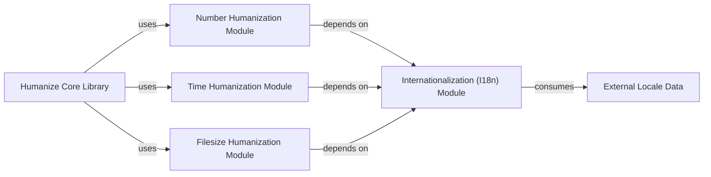

## Details

The `humanize` library follows a clear functional decomposition, centered around a Humanize Core Library that delegates specific data humanization tasks to dedicated modules for numbers, time, and file sizes. A crucial Internationalization (I18n) Module provides localization services, ensuring all humanized outputs are culturally appropriate by consuming External Locale Data. This design promotes modularity, allowing each humanization type to be developed and maintained independently while centralizing the complex logic of internationalization, making the library adaptable and globally usable.

### Humanize Core Library [[Expand]](./Humanize_Core_Library.md)
The main entry point and orchestrator, exposing humanization functions to users.

**Related Classes/Methods**:

- <a href="https://github.com/jmoiron/humanize/blob/master/src/humanize/__init__.py" target="_blank" rel="noopener noreferrer">`src/humanize/__init__.py`</a>

### Number Humanization Module [[Expand]](./Number_Humanization_Module.md)
Handles formatting of numerical data (e.g., `intcomma`, `ordinal`).

**Related Classes/Methods**:

- <a href="https://github.com/jmoiron/humanize/blob/master/src/humanize/number.py" target="_blank" rel="noopener noreferrer">`src/humanize/number.py`</a>

### Time Humanization Module [[Expand]](./Time_Humanization_Module.md)
Manages human-readable representations of dates and times (e.g., `naturaltime`, `naturaldate`).

**Related Classes/Methods**:

- <a href="https://github.com/jmoiron/humanize/blob/master/src/humanize/time.py" target="_blank" rel="noopener noreferrer">`src/humanize/time.py`</a>

### Filesize Humanization Module [[Expand]](./Filesize_Humanization_Module.md)
Converts byte counts into human-readable file sizes (e.g., `naturalsize`).

**Related Classes/Methods**:

- <a href="https://github.com/jmoiron/humanize/blob/master/src/humanize/filesize.py" target="_blank" rel="noopener noreferrer">`src/humanize/filesize.py`</a>

### Internationalization (I18n) Module [[Expand]](./Internationalization_I18n_Module.md)
Provides core localization and translation services, managing active locales and retrieving translated strings.

**Related Classes/Methods**:

- <a href="https://github.com/jmoiron/humanize/blob/master/src/humanize/i18n.py" target="_blank" rel="noopener noreferrer">`src/humanize/i18n.py`</a>

### External Locale Data
Contains the actual translation files and pluralization rules used by the I18n Module.

**Related Classes/Methods**:

- <a href="https://github.com/jmoiron/humanize/blob/master/src/humanize/locale/" target="_blank" rel="noopener noreferrer">`src/humanize/locale/`</a>

### [FAQ](https://github.com/CodeBoarding/GeneratedOnBoardings/tree/main?tab=readme-ov-file#faq)