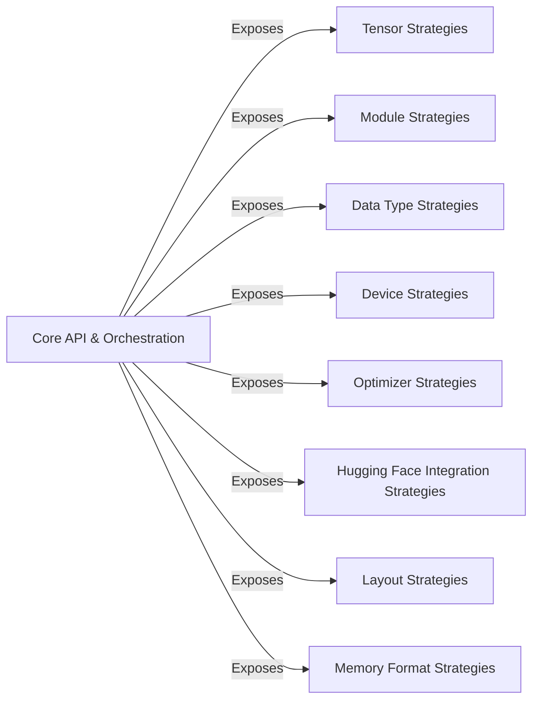

## Details

Analysis of the Core API & Orchestration component and its relationships within the hypothesis-torch library.

### Core API & Orchestration [[Expand]](./Core_API_Orchestration.md)
This component serves as the primary entry point for users, exposing top-level strategy functions and managing global library configurations. It orchestrates the integration and availability of various specialized strategies, providing a unified interface for property-based testing of PyTorch applications. It acts as the public API for the `hypothesis-torch` library.

**Related Classes/Methods**:

- `hypothesis_torch` (1:1000)

### Tensor Strategies
Strategies related to PyTorch Tensors.

**Related Classes/Methods**: _None_

### Module Strategies
Strategies related to PyTorch Modules.

**Related Classes/Methods**: _None_

### Data Type Strategies
Strategies related to PyTorch Data Types.

**Related Classes/Methods**: _None_

### Device Strategies
Strategies related to PyTorch Devices.

**Related Classes/Methods**: _None_

### Optimizer Strategies
Strategies related to PyTorch Optimizers.

**Related Classes/Methods**: _None_

### Hugging Face Integration Strategies
Strategies related to Hugging Face Integrations.

**Related Classes/Methods**: _None_

### Layout Strategies
Strategies related to PyTorch Layouts.

**Related Classes/Methods**: _None_

### Memory Format Strategies
Strategies related to PyTorch Memory Formats.

**Related Classes/Methods**: _None_

### [FAQ](https://github.com/CodeBoarding/GeneratedOnBoardings/tree/main?tab=readme-ov-file#faq)