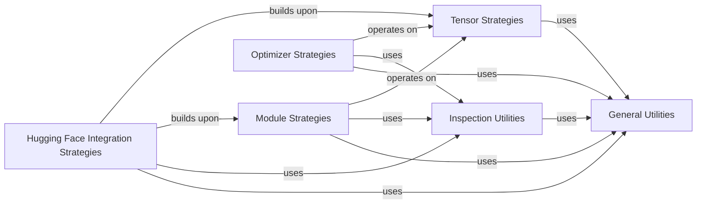

## Details

One paragraph explaining the functionality which is represented by this graph. What the main flow is and what is its purpose.

### Tensor Strategies
This component is responsible for generating diverse `torch.Tensor` instances. It provides strategies to control tensor properties such as shape, data type, device, layout, memory format, and numerical values. It is the foundational component, as most PyTorch operations and components ultimately interact with tensors.

**Related Classes/Methods**:

- <a href="https://github.com/qthequartermasterman/hypothesis-torch/blob/main/hypothesis_torch/tensor.py" target="_blank" rel="noopener noreferrer">`hypothesis_torch.tensor.tensors`</a>
- <a href="https://github.com/qthequartermasterman/hypothesis-torch/blob/main/hypothesis_torch/dtype.py" target="_blank" rel="noopener noreferrer">`hypothesis_torch.dtype.dtypes`</a>
- <a href="https://github.com/qthequartermasterman/hypothesis-torch/blob/main/hypothesis_torch/device.py" target="_blank" rel="noopener noreferrer">`hypothesis_torch.device.devices`</a>
- <a href="https://github.com/qthequartermasterman/hypothesis-torch/blob/main/hypothesis_torch/layout.py" target="_blank" rel="noopener noreferrer">`hypothesis_torch.layout.layouts`</a>
- <a href="https://github.com/qthequartermasterman/hypothesis-torch/blob/main/hypothesis_torch/memory_format.py" target="_blank" rel="noopener noreferrer">`hypothesis_torch.memory_format.memory_formats`</a>

### Module Strategies
This component provides Hypothesis strategies for constructing and testing `torch.nn.Module` architectures. It enables the generation of various neural network layers, entire models, and their associated parameters, facilitating the testing of forward passes, parameter initialization, and architectural properties.

**Related Classes/Methods**:

- <a href="https://github.com/qthequartermasterman/hypothesis-torch/blob/main/hypothesis_torch/module.py" target="_blank" rel="noopener noreferrer">`hypothesis_torch.module.modules`</a>

### Optimizer Strategies
This component focuses on generating `torch.optim.Optimizer` instances and their configurations. It provides strategies for different optimization algorithms (e.g., SGD, Adam) and their hyper-parameters, allowing for comprehensive testing of training loops and the optimization process.

**Related Classes/Methods**:

- <a href="https://github.com/qthequartermasterman/hypothesis-torch/blob/main/hypothesis_torch/optim.py" target="_blank" rel="noopener noreferrer">`hypothesis_torch.optim.optimizers`</a>

### Hugging Face Integration Strategies
This component extends the library's capabilities by offering Hypothesis strategies specifically tailored for generating inputs, configurations, or even model instances relevant to Hugging Face `transformers` models. It acts as an adapter, leveraging existing PyTorch strategies to support a widely used external deep learning library.

**Related Classes/Methods**:

- <a href="https://github.com/qthequartermasterman/hypothesis-torch/blob/main/hypothesis_torch/huggingface.py" target="_blank" rel="noopener noreferrer">`hypothesis_torch.huggingface.hf_configs`</a>
- <a href="https://github.com/qthequartermasterman/hypothesis-torch/blob/main/hypothesis_torch/huggingface.py" target="_blank" rel="noopener noreferrer">`hypothesis_torch.huggingface.hf_input_ids`</a>
- <a href="https://github.com/qthequartermasterman/hypothesis-torch/blob/main/hypothesis_torch/huggingface.py" target="_blank" rel="noopener noreferrer">`hypothesis_torch.huggingface.hf_models`</a>

### Inspection Utilities
This utility component provides functions for introspecting PyTorch objects, such as inferring function signatures, identifying subclasses, or extracting metadata. These utilities are crucial for dynamically building and adapting strategies for complex and varied PyTorch structures.

**Related Classes/Methods**:

- <a href="https://github.com/qthequartermasterman/hypothesis-torch/blob/main/hypothesis_torch/inspection_util.py" target="_blank" rel="noopener noreferrer">`hypothesis_torch.inspection_util.get_signature`</a>
- <a href="https://github.com/qthequartermasterman/hypothesis-torch/blob/main/hypothesis_torch/inspection_util.py" target="_blank" rel="noopener noreferrer">`hypothesis_torch.inspection_util.get_type_hints`</a>
- <a href="https://github.com/qthequartermasterman/hypothesis-torch/blob/main/hypothesis_torch/inspection_util.py" target="_blank" rel="noopener noreferrer">`hypothesis_torch.inspection_util.get_default_args`</a>
- <a href="https://github.com/qthequartermasterman/hypothesis-torch/blob/main/hypothesis_torch/inspection_util.py" target="_blank" rel="noopener noreferrer">`hypothesis_torch.inspection_util.get_class_init_signature`</a>
- <a href="https://github.com/qthequartermasterman/hypothesis-torch/blob/main/hypothesis_torch/inspection_util.py" target="_blank" rel="noopener noreferrer">`hypothesis_torch.inspection_util.get_class_init_type_hints`</a>
- <a href="https://github.com/qthequartermasterman/hypothesis-torch/blob/main/hypothesis_torch/inspection_util.py" target="_blank" rel="noopener noreferrer">`hypothesis_torch.inspection_util.get_class_init_default_args`</a>

### General Utilities
This component serves as a collection of common helper functions and general-purpose utilities used across various strategy modules. Its purpose is to promote code reusability, reduce duplication, and provide common functionalities that support the strategy generation process.

**Related Classes/Methods**:

- <a href="https://github.com/qthequartermasterman/hypothesis-torch/blob/main/hypothesis_torch/utils.py" target="_blank" rel="noopener noreferrer">`hypothesis_torch.utils.find_matching_dtype`</a>
- <a href="https://github.com/qthequartermasterman/hypothesis-torch/blob/main/hypothesis_torch/utils.py" target="_blank" rel="noopener noreferrer">`hypothesis_torch.utils.prod`</a>
- <a href="https://github.com/qthequartermasterman/hypothesis-torch/blob/main/hypothesis_torch/utils.py" target="_blank" rel="noopener noreferrer">`hypothesis_torch.utils.draw_values`</a>
- <a href="https://github.com/qthequartermasterman/hypothesis-torch/blob/main/hypothesis_torch/utils.py" target="_blank" rel="noopener noreferrer">`hypothesis_torch.utils.map_maybe`</a>
- <a href="https://github.com/qthequartermasterman/hypothesis-torch/blob/main/hypothesis_torch/utils.py" target="_blank" rel="noopener noreferrer">`hypothesis_torch.utils.is_lazy_module`</a>
- <a href="https://github.com/qthequartermasterman/hypothesis-torch/blob/main/hypothesis_torch/utils.py" target="_blank" rel="noopener noreferrer">`hypothesis_torch.utils.is_lazy_parameter`</a>

### [FAQ](https://github.com/CodeBoarding/GeneratedOnBoardings/tree/main?tab=readme-ov-file#faq)