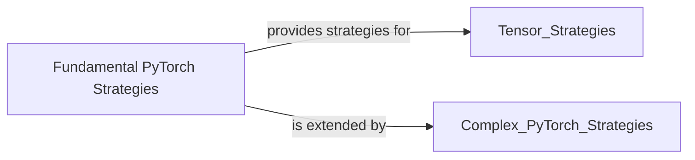

## Details

Abstract Components Overview

### Fundamental PyTorch Strategies [[Expand]](./Fundamental_PyTorch_Strategies.md)
This component encapsulates Hypothesis strategies for generating basic PyTorch-specific types, such as data types (dtype), devices (device), tensor layouts (layout), and memory formats (memory_format). These strategies form the foundational building blocks for more complex PyTorch component generation, enabling comprehensive property-based testing across various PyTorch configurations.

**Related Classes/Methods**:

- <a href="https://github.com/qthequartermasterman/hypothesis-torch/blob/main/hypothesis_torch/device.py#L18-L38" target="_blank" rel="noopener noreferrer">`hypothesis_torch.device.device_strategy` (18:38)</a>
- <a href="https://github.com/qthequartermasterman/hypothesis-torch/blob/main/hypothesis_torch/dtype.py#L69-L80" target="_blank" rel="noopener noreferrer">`hypothesis_torch.dtype.dtype_strategy` (69:80)</a>
- <a href="https://github.com/qthequartermasterman/hypothesis-torch/blob/main/hypothesis_torch/layout.py#L19-L27" target="_blank" rel="noopener noreferrer">`hypothesis_torch.layout.layout_strategy` (19:27)</a>
- <a href="https://github.com/qthequartermasterman/hypothesis-torch/blob/main/hypothesis_torch/memory_format.py#L16-L26" target="_blank" rel="noopener noreferrer">`hypothesis_torch.memory_format.memory_format_strategy` (16:26)</a>

### [FAQ](https://github.com/CodeBoarding/GeneratedOnBoardings/tree/main?tab=readme-ov-file#faq)