```mermaid
graph LR
    Core_API_Orchestration["Core API & Orchestration"]
    Fundamental_PyTorch_Strategies["Fundamental PyTorch Strategies"]
    Domain_Specific_PyTorch_Strategies["Domain-Specific PyTorch Strategies"]
    Utility_Introspection["Utility & Introspection"]
    Core_API_Orchestration -- "Utilizes" --> Fundamental_PyTorch_Strategies
    Core_API_Orchestration -- "Orchestrates" --> Domain_Specific_PyTorch_Strategies
    Fundamental_PyTorch_Strategies -- "Provides Building Blocks To" --> Core_API_Orchestration
    Fundamental_PyTorch_Strategies -- "Consumed By" --> Domain_Specific_PyTorch_Strategies
    Domain_Specific_PyTorch_Strategies -- "Consumes" --> Fundamental_PyTorch_Strategies
    Domain_Specific_PyTorch_Strategies -- "Relies On" --> Utility_Introspection
    Utility_Introspection -- "Supports" --> Domain_Specific_PyTorch_Strategies
    click Core_API_Orchestration href "https://github.com/CodeBoarding/GeneratedOnBoardings/blob/main/hypothesis-torch/Core_API_Orchestration.md" "Details"
    click Fundamental_PyTorch_Strategies href "https://github.com/CodeBoarding/GeneratedOnBoardings/blob/main/hypothesis-torch/Fundamental_PyTorch_Strategies.md" "Details"
    click Domain_Specific_PyTorch_Strategies href "https://github.com/CodeBoarding/GeneratedOnBoardings/blob/main/hypothesis-torch/Domain_Specific_PyTorch_Strategies.md" "Details"
```

## Details

The `hypothesis-torch` project is designed as a property-based testing library that extends the Hypothesis framework to generate and test various PyTorch components. Its architecture is highly modular, allowing for flexible and comprehensive testing of deep learning models. The main flow involves users interacting with the `Core API & Orchestration` to initiate strategy generation, which then leverages `Fundamental PyTorch Strategies` for basic type generation and `Domain-Specific PyTorch Strategies` for more complex PyTorch structures. The entire process is supported by `Utility & Introspection` for dynamic object analysis and general helper functions.

### Core API & Orchestration [[Expand]](./Core_API_Orchestration.md)
This component serves as the primary entry point for users, exposing top-level strategy functions and managing global library configurations. It orchestrates the integration and availability of various specialized strategies, providing a unified interface for property-based testing of PyTorch applications.

**Related Classes/Methods**:

- <a href="https://github.com/qthequartermasterman/hypothesis-torch/blob/main/hypothesis_torch/__init__.py#L1-L1" target="_blank" rel="noopener noreferrer">`hypothesis_torch/__init__.py` (1:1)</a>

### Fundamental PyTorch Strategies [[Expand]](./Fundamental_PyTorch_Strategies.md)
Encapsulates Hypothesis strategies for generating basic PyTorch-specific types, such as data types (`dtype`), devices (`device`), tensor layouts (`layout`), and memory formats (`memory_format`). These strategies form the foundational building blocks for more complex PyTorch component generation.

**Related Classes/Methods**:

- <a href="https://github.com/qthequartermasterman/hypothesis-torch/blob/main/hypothesis_torch/device.py#L1-L1" target="_blank" rel="noopener noreferrer">`hypothesis_torch/device.py` (1:1)</a>
- <a href="https://github.com/qthequartermasterman/hypothesis-torch/blob/main/hypothesis_torch/dtype.py#L1-L1" target="_blank" rel="noopener noreferrer">`hypothesis_torch/dtype.py` (1:1)</a>
- <a href="https://github.com/qthequartermasterman/hypothesis-torch/blob/main/hypothesis_torch/layout.py#L1-L1" target="_blank" rel="noopener noreferrer">`hypothesis_torch/layout.py` (1:1)</a>
- <a href="https://github.com/qthequartermasterman/hypothesis-torch/blob/main/hypothesis_torch/memory_format.py#L1-L1" target="_blank" rel="noopener noreferrer">`hypothesis_torch/memory_format.py` (1:1)</a>

### Domain-Specific PyTorch Strategies [[Expand]](./Domain_Specific_PyTorch_Strategies.md)
Provides a comprehensive collection of Hypothesis strategies tailored for generating and testing complex PyTorch components. This includes strategies for `torch.Tensor` instances, `nn.Module` architectures, `optim.Optimizer` configurations, and specialized integrations for Hugging Face `transformers` models.

**Related Classes/Methods**:

- <a href="https://github.com/qthequartermasterman/hypothesis-torch/blob/main/hypothesis_torch/tensor.py#L1-L1" target="_blank" rel="noopener noreferrer">`hypothesis_torch/tensor.py` (1:1)</a>
- <a href="https://github.com/qthequartermasterman/hypothesis-torch/blob/main/hypothesis_torch/module.py#L1-L1" target="_blank" rel="noopener noreferrer">`hypothesis_torch/module.py` (1:1)</a>
- <a href="https://github.com/qthequartermasterman/hypothesis-torch/blob/main/hypothesis_torch/optim.py#L1-L1" target="_blank" rel="noopener noreferrer">`hypothesis_torch/optim.py` (1:1)</a>
- <a href="https://github.com/qthequartermasterman/hypothesis-torch/blob/main/hypothesis_torch/huggingface.py#L1-L1" target="_blank" rel="noopener noreferrer">`hypothesis_torch/huggingface.py` (1:1)</a>

### Utility & Introspection
Contains general-purpose helper functions and crucial utilities for runtime inspection of Python objects. This component enables dynamic inference of function signatures, annotations, and class hierarchies, which is vital for building flexible and adaptive strategies, particularly for dynamically constructing PyTorch modules and optimizers.

**Related Classes/Methods**:

- <a href="https://github.com/qthequartermasterman/hypothesis-torch/blob/main/hypothesis_torch/inspection_util.py#L1-L1" target="_blank" rel="noopener noreferrer">`hypothesis_torch/inspection_util.py` (1:1)</a>
- <a href="https://github.com/qthequartermasterman/hypothesis-torch/blob/main/hypothesis_torch/utils.py#L1-L1" target="_blank" rel="noopener noreferrer">`hypothesis_torch/utils.py` (1:1)</a>

### [FAQ](https://github.com/CodeBoarding/GeneratedOnBoardings/tree/main?tab=readme-ov-file#faq)