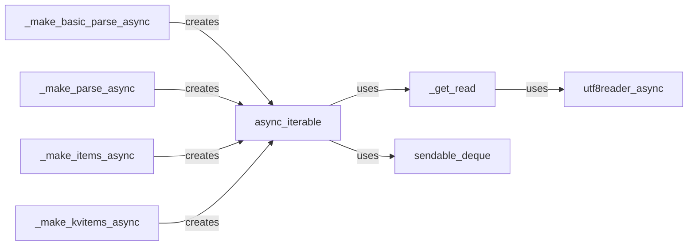

## Component Details

The Async Utilities component provides the necessary tools for asynchronous JSON parsing within the ijson library. It focuses on enabling non-blocking operations, making it suitable for asynchronous applications. The core functionality revolves around creating asynchronous iterables from file-like objects and coroutine pipelines, handling UTF-8 encoding, and providing functions for parsing basic JSON structures, items, and key-value pairs asynchronously. It uses a combination of asynchronous readers, deques for data transfer, and specialized functions to create asynchronous parsing pipelines.

### utf8reader_async
Asynchronously reads UTF-8 encoded strings from an asynchronous reader. It handles the decoding of bytes into strings, ensuring proper handling of UTF-8 characters in an asynchronous context.
- **Related Classes/Methods**: `ijson.src.ijson.utils35`

### _get_read
Determines and returns the appropriate asynchronous read function based on the input source type (bytes or string). This function acts as a dispatcher, selecting the correct reader based on the input type to ensure proper data handling.
- **Related Classes/Methods**: `ijson.src.ijson.utils35`

### sendable_deque
A deque that supports sending data to a coroutine. It facilitates the transfer of data between asynchronous tasks, enabling efficient communication within the parsing pipeline.
- **Related Classes/Methods**: `ijson.src.ijson.utils35`

### async_iterable
Wraps an asynchronous file-like object and a coroutine pipeline to provide an asynchronous iterable of JSON events. This class is central to the asynchronous parsing process, as it manages the flow of data from the input source through the parsing pipeline, yielding JSON events asynchronously.
- **Related Classes/Methods**: `ijson.src.ijson.utils35`

### _make_basic_parse_async
Creates an asynchronous parsing function for basic JSON parsing using a specified backend. It sets up the asynchronous parsing pipeline for simple JSON structures, leveraging the specified backend for parsing.
- **Related Classes/Methods**: `ijson.src.ijson.utils35`

### _make_parse_async
Creates a general asynchronous parsing function using a specified backend. This function provides a more comprehensive parsing capability, handling various JSON structures asynchronously.
- **Related Classes/Methods**: `ijson.src.ijson.utils35`

### _make_items_async
Creates an asynchronous function that yields individual items from a JSON array using a specified backend. It focuses on extracting and yielding individual elements from JSON arrays in an asynchronous manner.
- **Related Classes/Methods**: `ijson.src.ijson.utils35`

### _make_kvitems_async
Creates an asynchronous function that yields key-value pairs from a JSON object using a specified backend. This function is designed to extract and yield key-value pairs from JSON objects asynchronously.
- **Related Classes/Methods**: `ijson.src.ijson.utils35`
