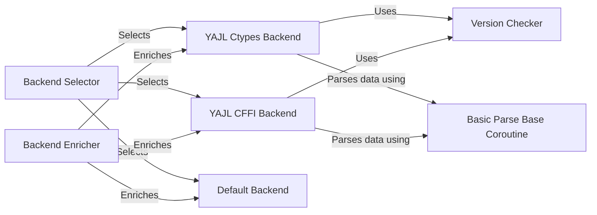

## Component Details

The ijson library provides an iterative JSON parser for Python. The core functionality revolves around selecting and utilizing the most efficient backend for parsing JSON data. The process begins with the Backend Selector identifying available yajl implementations (ctypes or cffi) or falling back to a default pure Python implementation. The selected backend is then enriched with standard functionalities by the Backend Enricher, ensuring a consistent interface. The Version Checker validates the yajl library version for compatibility. Finally, the chosen backend, often leveraging the Basic Parse Base Coroutine for low-level parsing, processes the input stream and generates events representing the JSON structure.

### Backend Selector
The Backend Selector is responsible for identifying and choosing the most suitable JSON parsing backend. It probes for available `yajl` implementations (both `ctypes` and `cffi` versions) and selects the best one based on performance and availability. If no suitable `yajl` backend is found, it falls back to the `_default_backend`.
- **Related Classes/Methods**: `ijson.src.ijson.backends:find_yajl_ctypes`, `ijson.src.ijson.backends:find_yajl_cffi`

### YAJL Ctypes Backend
This component provides a JSON parsing backend using the `yajl` C library accessed through `ctypes`. It handles the allocation and configuration of the `yajl` parser, feeding it data from the input stream, and converting the resulting events into a format suitable for `ijson`'s internal processing. It depends on `_yajl2_ctypes_common` for low-level interactions with the `yajl` library.
- **Related Classes/Methods**: `ijson.src.ijson.backends:find_yajl_ctypes`, `ijson.src.ijson.backends:basic_parse_basecoro`

### YAJL CFFI Backend
This component provides a JSON parsing backend using the `yajl` C library accessed through `cffi`. It mirrors the functionality of the `YAJL Ctypes Backend` but utilizes `cffi` for interacting with the `yajl` library. It also depends on `_yajl2_ctypes_common` for low-level interactions with the `yajl` library.
- **Related Classes/Methods**: `ijson.src.ijson.backends:find_yajl_cffi`, `ijson.src.ijson.backends:basic_parse_basecoro`

### Default Backend
The Default Backend serves as a fallback JSON parsing implementation when no optimized `yajl` backend is available. It provides a pure Python implementation of the core parsing logic. It is less performant than the `yajl` backends but ensures that `ijson` can function in environments where `yajl` is not installed.
- **Related Classes/Methods**: `ijson.src.ijson:_default_backend`

### Backend Enricher
The Backend Enricher component enhances a given backend with a standard set of functionalities required by `ijson`. It ensures that all backends, regardless of their underlying implementation, expose a consistent interface. This includes providing implementations for coroutines and generators for different parsing modes (basic_parse, parse, items, kvitems) if the backend doesn't natively support them.
- **Related Classes/Methods**: `ijson.src.ijson.common:enrich_backend`

### Version Checker
The Version Checker component validates that the version of the `yajl` library found by the backend selector meets the minimum requirements of `ijson`. This ensures compatibility and prevents potential issues caused by using older or incompatible versions of `yajl`.
- **Related Classes/Methods**: `ijson.src.ijson.backends:require_version`

### Basic Parse Base Coroutine
The Basic Parse Base Coroutine is a core component responsible for the low-level parsing of JSON data. It receives chunks of data, feeds them to the underlying yajl parser, and yields unprefixed events representing the structure and content of the JSON document. It handles configuration options such as allowing comments and multiple values.
- **Related Classes/Methods**: `ijson.src.ijson.backends:basic_parse_basecoro`
