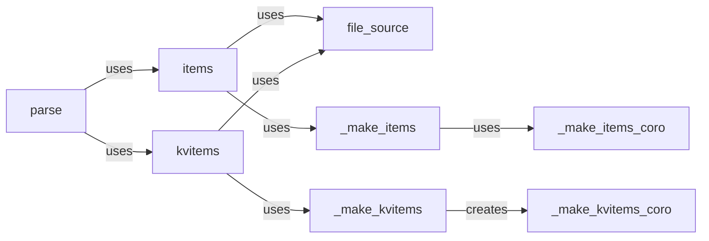

## Component Details

The Core Parsing API in `ijson` provides a high-level interface for parsing JSON data from various sources, including files and file-like objects. It abstracts away the complexities of handling different input types and asynchronous operations, offering a consistent way to extract items or key-value pairs from JSON. The API uses backend-specific coroutines or generators to perform the actual parsing, allowing for flexibility and optimization based on the input source and desired output format. The main flow involves determining the input type, selecting the appropriate parsing function, and yielding the parsed data to the user.

### parse
The `parse` function is the primary entry point for parsing JSON data. It intelligently determines the input type and delegates the parsing task to either `items` or `kvitems` based on the desired output format.
- **Related Classes/Methods**: `ijson.src.ijson.common:parse`

### items
The `items` function generates individual items from a JSON source. It utilizes `file_source` to handle file input and then calls `_make_items` to create a backend-specific function (coroutine or generator) for parsing and yielding items.
- **Related Classes/Methods**: `ijson.src.ijson.common:items`

### kvitems
The `kvitems` function generates key-value pairs from a JSON source. Similar to `items`, it uses `file_source` for file input and `_make_kvitems` to create a backend-specific function for parsing and yielding key-value pairs.
- **Related Classes/Methods**: `ijson.src.ijson.common:kvitems`

### file_source
The `file_source` function ensures that the input is a file-like object. If the input is a string representing a file path, it opens the file in read mode. This abstraction simplifies the parsing functions by providing a consistent input type.
- **Related Classes/Methods**: `ijson.src.ijson.common:file_source`

### _make_items
The `_make_items` function dynamically creates a function (either a coroutine or a generator) that yields individual items from a JSON source. The choice between coroutine and generator depends on whether the input is asynchronous.
- **Related Classes/Methods**: `ijson.src.ijson.common:_make_items`

### _make_kvitems
The `_make_kvitems` function is similar to `_make_items`, but it creates a function that yields key-value pairs from a JSON source, again choosing between coroutine and generator based on the input's asynchronous nature.
- **Related Classes/Methods**: `ijson.src.ijson.common:_make_kvitems`

### _make_items_coro
The `_make_items_coro` function creates a coroutine that yields individual items from a JSON source.
- **Related Classes/Methods**: `ijson.src.ijson.common:_make_items_coro`

### _make_kvitems_coro
The `_make_kvitems_coro` function creates a coroutine that yields key-value pairs from a JSON source.
- **Related Classes/Methods**: `ijson.src.ijson.common:_make_kvitems_coro`
