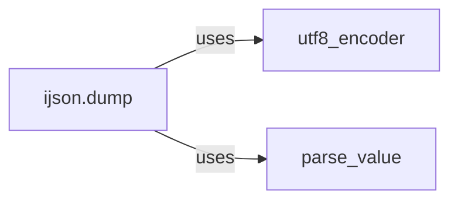

## Component Details

The Dump API provides functionality to serialize Python objects into a JSON-like stream. The main flow starts with the `ijson.dump` function, which takes a Python object and an output stream as input. It then uses the `utf8_encoder` to ensure that string data is encoded in UTF-8 before being written to the output stream. The `parse_value` function is used to recursively convert Python values into JSON tokens, which are then written to the output stream. The `Lexer` is used to break down the input stream into a series of tokens.

### ijson.dump
The `dump` function serves as the entry point for serializing Python objects into a JSON-like stream. It orchestrates the conversion of a Python object into its JSON representation and writes it to the provided output stream. It handles the overall process of traversing the Python object and generating the corresponding JSON output.
- **Related Classes/Methods**: `ijson.src.ijson.dump:dump`

### utf8_encoder
The `utf8_encoder` function ensures that string data is encoded in UTF-8 before being written to the output stream. This is crucial for maintaining compatibility and correctness when dealing with Unicode characters. It acts as a filter, converting Python strings to UTF-8 encoded bytes before they are written to the output.
- **Related Classes/Methods**: `ijson.src.ijson.backends.python:utf8_encoder`

### parse_value
The `parse_value` function takes a Python value and recursively converts it into JSON tokens, which are then written to the output stream. It handles different data types, including strings, numbers, objects, and arrays. It is responsible for the core logic of converting Python data structures into their JSON equivalents.
- **Related Classes/Methods**: `ijson.src.ijson.backends.python:parse_value`
