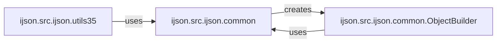

## Component Details

The ijson library provides a way to incrementally parse large JSON files. It consists of several components that work together to achieve this. The core functionality resides in the `common` module, which provides functions for creating different types of JSON parsers (regular, coroutine, and generator-based). The `ObjectBuilder` class is responsible for constructing Python objects from the stream of JSON events emitted by the parser. The `utils35` module offers asynchronous versions of the parser creation functions. These components interact to parse JSON data, build Python objects, and provide flexibility in how the parsing is performed.

### ijson.src.ijson.common
This module contains core functions for creating JSON parsers. It provides functions to generate parsers that emit basic events, build objects, or extract items and key-value pairs from JSON data. It includes functions for creating regular, coroutine, and generator-based parsers.
- **Related Classes/Methods**: `ijson.src.ijson.common:parse`, `ijson.src.ijson.common:kvitems`, `ijson.src.ijson.common:items`, `ijson.src.ijson.common:_make_basic_parse`, `ijson.src.ijson.common:_make_parse`, `ijson.src.ijson.common:_make_items`, `ijson.src.ijson.common:_make_kvitems`, `ijson.src.ijson.common:_make_basic_parse_coro`, `ijson.src.ijson.common:_make_parse_coro`, `ijson.src.ijson.common:_make_items_coro`, `ijson.src.ijson.common:_make_kvitems_coro`, `ijson.src.ijson.common:_make_basic_parse_gen`, `ijson.src.ijson.common:_make_parse_gen`, `ijson.src.ijson.common:_make_items_gen`, `ijson.src.ijson.common:_make_kvitems_gen`

### ijson.src.ijson.utils35
This module provides asynchronous versions of the parser creation functions found in the `common` module. It allows for parsing JSON data in an asynchronous manner, potentially improving performance in I/O-bound scenarios.
- **Related Classes/Methods**: `ijson.src.ijson.utils35:_make_basic_parse_async`, `ijson.src.ijson.utils35:_make_parse_async`, `ijson.src.ijson.utils35:_make_items_async`, `ijson.src.ijson.utils35:_make_kvitems_async`

### ijson.src.ijson.common.ObjectBuilder
This class is responsible for building Python objects from the stream of JSON events. It receives events like 'start_map', 'key', 'string', 'number', etc., and constructs dictionaries, lists, and primitive values accordingly. It interacts with the parser to receive events and emits fully constructed objects.
- **Related Classes/Methods**: `ijson.src.ijson.common.ObjectBuilder:event`
