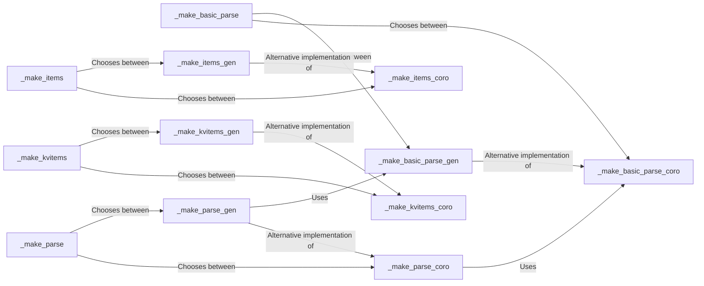

## Component Details

This component provides a set of functions for generating coroutines and generators that parse JSON data. It abstracts the underlying parsing logic and offers different parsing strategies for basic values, complex structures, arrays, and objects. The choice between coroutines and generators is determined by the `use_float` parameter, allowing for flexibility in different environments.

### _make_basic_parse
A higher-order function that creates either a basic JSON parsing coroutine or generator based on the `use_float` parameter. It abstracts the choice between coroutine and generator implementations for parsing basic JSON values (numbers, strings, booleans, null).
- **Related Classes/Methods**: `ijson.src.ijson.common:_make_basic_parse`

### _make_parse
A higher-order function that creates either a general JSON parsing coroutine or generator based on the `use_float` parameter. It abstracts the choice between coroutine and generator implementations for complex JSON structures (objects, arrays).
- **Related Classes/Methods**: `ijson.src.ijson.common:_make_parse`

### _make_items
A higher-order function that creates either an items parsing coroutine or generator based on the `use_float` parameter. It abstracts the choice between coroutine and generator implementations for parsing JSON arrays and yielding individual items.
- **Related Classes/Methods**: `ijson.src.ijson.common:_make_items`

### _make_kvitems
A higher-order function that creates either a key-value items parsing coroutine or generator based on the `use_float` parameter. It abstracts the choice between coroutine and generator implementations for parsing JSON objects and yielding key-value pairs.
- **Related Classes/Methods**: `ijson.src.ijson.common:_make_kvitems`

### _make_basic_parse_coro
Creates a coroutine that parses basic JSON values (numbers, strings, booleans, null) and yields events. It handles the initial parsing setup and error handling for coroutine-based parsers.
- **Related Classes/Methods**: `ijson.src.ijson.common:_make_basic_parse_coro`

### _make_parse_coro
Creates a coroutine that parses complex JSON structures (objects, arrays) and yields events. It builds upon `_make_basic_parse_coro` to handle nested structures and more complex parsing scenarios.
- **Related Classes/Methods**: `ijson.src.ijson.common:_make_parse_coro`

### _make_items_coro
Creates a coroutine that parses a JSON array and yields individual items as events. It is used when the parser needs to iterate over the elements of an array.
- **Related Classes/Methods**: `ijson.src.ijson.common:_make_items_coro`

### _make_kvitems_coro
Creates a coroutine that parses a JSON object and yields key-value pairs as events. It is used when the parser needs to iterate over the key-value pairs of an object.
- **Related Classes/Methods**: `ijson.src.ijson.common:_make_kvitems_coro`

### _make_basic_parse_gen
Creates a generator that parses basic JSON values and yields events. It provides the same functionality as `_make_basic_parse_coro` but uses a generator instead of a coroutine.
- **Related Classes/Methods**: `ijson.src.ijson.common:_make_basic_parse_gen`

### _make_parse_gen
Creates a generator that parses complex JSON structures and yields events. It builds upon `_make_basic_parse_gen` to handle nested structures and more complex parsing scenarios, similar to `_make_parse_coro`.
- **Related Classes/Methods**: `ijson.src.ijson.common:_make_parse_gen`
