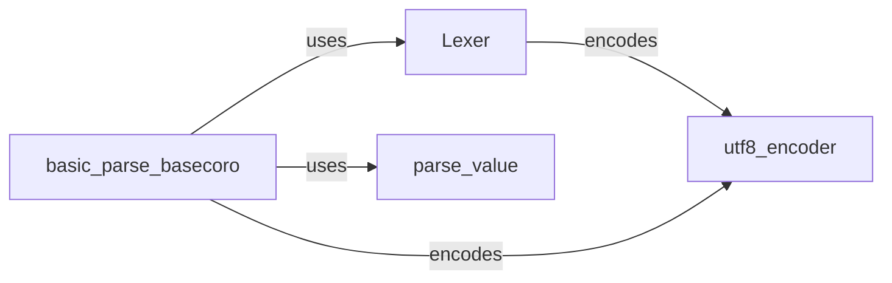

## Component Details

The Python backend provides a pure Python implementation for parsing JSON. It includes a UTF-8 encoder, a Lexer for tokenizing the input stream, a parse_value function for constructing Python objects from tokens, and a core parsing function (basic_parse_basecoro) that orchestrates the entire process. This backend serves as a fallback when other, faster backends are unavailable.

### utf8_encoder
Encodes strings to UTF-8. This is crucial for handling Unicode characters in JSON, ensuring that the input stream is properly encoded before parsing. It's used by the Lexer to properly decode the input stream.
- **Related Classes/Methods**: `ijson.src.ijson.backends.python:utf8_encoder`

### Lexer
The Lexer class is responsible for tokenizing the input stream. It reads the stream and breaks it down into individual tokens, such as strings, numbers, and punctuation, which are then passed to the parser. It uses the utf8_encoder to handle unicode.
- **Related Classes/Methods**: `ijson.src.ijson.backends.python:Lexer`

### parse_value
Parses a JSON value from a token stream. It determines the type of the value (e.g., string, number, object, array) based on the current token and constructs the corresponding Python object. This function is called by the core parsing logic to handle individual values.
- **Related Classes/Methods**: `ijson.src.ijson.backends.python:parse_value`

### basic_parse_basecoro
The core parsing logic. It orchestrates the lexing and parsing of JSON data, handling different types of tokens and constructing the final JSON structure. It uses the Lexer to get tokens and the parse_value function to construct values. It also uses the utf8_encoder to encode the input.
- **Related Classes/Methods**: `ijson.src.ijson.backends.python:basic_parse_basecoro`
