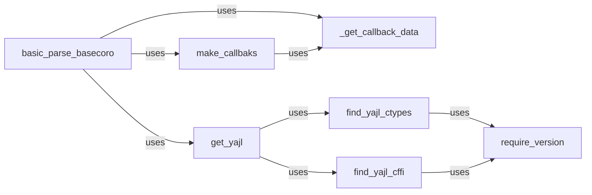

## Component Details

The Yajl Backend component provides JSON parsing functionality using the `yajl` library. It handles loading the library, creating callbacks for parsing events, and orchestrating the parsing process. The main flow involves locating and loading the yajl library (either through `ctypes` or `cffi`), creating callback functions that respond to parsing events, and then using these callbacks to parse the JSON data. The purpose is to provide an efficient and reliable JSON parsing implementation using the yajl library.

### basic_parse_basecoro
This coroutine is the main entry point for parsing JSON data using the yajl backend. It initializes the yajl parser, feeds data to it, and handles events triggered by the parser via callbacks. It orchestrates the parsing process and yields events to the caller.
- **Related Classes/Methods**: `ijson.src.ijson.backends.yajl:basic_parse_basecoro`

### _get_callback_data
This function retrieves data needed by the yajl callbacks. It extracts relevant information from the parser's internal state or from the data being parsed, and makes it available to the callback functions. This ensures that the callbacks have the necessary context to process the JSON events.
- **Related Classes/Methods**: `ijson.src.ijson.backends._yajl2_ctypes_common:_get_callback_data`

### get_yajl
This function is responsible for obtaining a reference to the yajl library. It attempts to load the library using either `ctypes` or `cffi`. It also handles caching the loaded library to avoid redundant loading.
- **Related Classes/Methods**: `ijson.src.ijson.backends._yajl2_ctypes_common:get_yajl`

### make_callbaks
This function creates the callback functions that will be invoked by the yajl parser when it encounters different JSON events (e.g., start of object, end of array, string value). These callbacks are crucial for processing the JSON data and extracting the desired information. It configures the callbacks to use `_get_callback_data` to access relevant parsing context.
- **Related Classes/Methods**: `ijson.src.ijson.backends._yajl2_ctypes_common:make_callbaks`

### require_version
This function checks if the installed yajl library meets the minimum version requirement. It ensures that the library has the necessary features and bug fixes for the ijson library to function correctly. It raises an exception if the version requirement is not met.
- **Related Classes/Methods**: `ijson.src.ijson.backends:require_version`

### find_yajl_ctypes
This function attempts to locate and load the yajl library using the `ctypes` library. `ctypes` allows Python code to call functions in dynamically linked libraries (DLLs or shared objects). It uses `require_version` to validate the found library.
- **Related Classes/Methods**: `ijson.src.ijson.backends:find_yajl_ctypes`

### find_yajl_cffi
This function attempts to locate and load the yajl library using the `cffi` library. `cffi` is another way to call C code from Python, and it often offers better performance than `ctypes`. It uses `require_version` to validate the found library.
- **Related Classes/Methods**: `ijson.src.ijson.backends:find_yajl_cffi`
